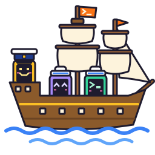

<div align="center">


**Ship - A Terminal Workspace for Working Alongside Coding Agents**

[Overview](#overview) •
[Features](#features) •
[Status](#status) •
[Installation](#installation) •
[Keys](#keys) •
[Configuration](#configuration)

</div>

> [!WARNING]
> **Ship is a work in progress.** There are no releases yet, and much of what the [Features](#features) section describes isn't built yet. [Status](#status) covers what works right now.

## Overview

If you run a few coding agents at once, you end up with a pile of terminals: an agent in one, an editor in another, a shell running tests, another agent somewhere else. Typing the commands is the easy part. The hard part is keeping track of it all. Which agent finished? Which one is stuck waiting on you? Where did you leave it?

Ship puts all of that in one place. It keeps your shells, editors and agents together, keeps them running when you close the window, shows you which agent needs attention, and lets agents drive the workspace themselves.

The name treats agents as your crew, and it's also about shipping software.

## Features

### Organize your work
- **Tabs and split panes:**
  Group related work into tabs. Tabs can nest inside other tabs, so a big task can hold its own smaller ones.

- **Multiple clients, independent views:**
  Attach from more than one terminal at a time. Each client keeps its own selection and focus while sharing the same underlying work.

### Leave and come back
- **Work that keeps running:**
  Ship's server owns your terminals, so closing the window doesn't stop anything. Reattach later and everything is where you left it.

- **Restore after a restart:**
  If the server or machine restarts, Ship rebuilds your tabs and panes, and resumes agent conversations where the agent supports it.

### Know which agent needs you
- **Agent status at a glance:**
  See which agents are working, blocked, idle or done with something you haven't looked at yet. When Ship can't tell, it says so instead of guessing.

- **Jump to the one that needs you:**
  An agent list and notifications get you to a waiting agent without checking every pane.

### Let agents operate the workspace
- **A command-line interface agents can use:**
  Agents can open panes, run commands, send input, read output, and wait for another agent to finish, all through `ship` itself.

### Small and fast
- **Built on existing libraries:**
  Ship leans on solid libraries for the mechanical parts (terminal emulation, PTYs, transport) and only writes the parts that are actually Ship. The goal is a codebase small enough to actually read. Small enough, in fact, that the whole thing fits in your agent's (sorry, crewmate's) context window.

- **Snappy:**
  Ship should feel at least as fast as tmux, Zellij and Herdr.

- **Linux and macOS first:**
  Both are priority platforms. Windows is best effort.

### Why another multiplexer?
tmux and Zellij keep terminals alive, but they don't know what an agent is. [Herdr](https://github.com/herdrdev/herdr) does, and Ship is heavily inspired by it. Ship's angle is getting most of that daily value from a much smaller codebase.

## Status

Today, `ship` runs a background server that keeps track of nested tabs and panes. You can create, rename, move and close them from the command line. Running `ship` opens a full-screen client on the whole server that updates as things change. Each client keeps its own selection and reconnects on its own if the connection drops.

Each pane runs a real program, your shell by default, in its own terminal, and the server keeps it alive while clients come and go. Right/down splits now have a shared layout: inspection exposes the tree, programs receive their content sizes, and closing a pane gives its space to the sibling subtree. The client draws every pane of the viewed tab at once and moves between them with directional focus. The sidebar, zoom, swap, resize, agent status and restoring after a restart are still to come.

## Installation

There are no releases yet, so you'll need to build from source. You need a recent stable [Rust toolchain](https://www.rust-lang.org/tools/install).

1. Clone the repo
```sh
git clone https://github.com/Cyanistic/ship.git
cd ship
```
2. Build it
```sh
cargo build --release
```
3. Run it, or put it on your PATH with `cargo install --path crates/ship` so the examples below work as written
```sh
./target/release/ship
```

Running `ship` finds the local server or starts one in the background, then opens the client. A server that `ship` starts begins with one tab holding a shell in your home directory, and the client opens on it. Press `alt-q` to detach. The server keeps running after `ship` exits, and `ship server stop` stops it.

To see tabs change live, leave `ship` open in one terminal and add a tab from another:
```sh
TAB=$(ship tab create --name notes | jq -r .id)
ship pane create --tab "$TAB" --name scratch
```
Then press `alt-right` and `alt-left` in the client to move between top-level tabs. `ship tab close --tab "$TAB"` closes it again.

Inside a Ship pane you can leave out `--tab` and `--pane`: commands default to the pane they run in and the tab holding it. So `ship pane close` run in a pane closes that pane, and `ship pane create` adds a pane next to it.

### Split and close from the CLI

Create a shell, split it right, then split the right pane down:
```sh
TAB=$(ship tab create --name work | jq -r .id)
LEFT=$(ship pane create --tab "$TAB" --name left | jq -r .id)
RIGHT=$(ship pane create --pane "$LEFT" --direction right --name right | jq -r .id)
BOTTOM=$(ship pane create --pane "$RIGHT" --direction down --name bottom | jq -r .id)
ship tab get --tab "$TAB"
ship pane close --pane "$LEFT"
ship tab get --tab "$TAB"
ship tab close --tab "$TAB"
```

Inspection reports `layout`, whose `kind` is `pane` or `split`. A split has `axis`, first-child `ratio`, `first` and `second`; pane records live at the leaves in layout order. An empty tab omits `layout`. Closing `left` above lets `right` and `bottom` fill the tab. Viewers selected on the closed pane land in that sibling subtree; closing the last pane leaves an empty tab. Closing a pane ends its program, while the others keep running.

`--direction` defaults to `right`. With just `--tab`, creation splits the largest content rectangle, breaking ties in layout order, or creates the first pane in an empty tab. `--pane` anchors the split directly, including the default from `SHIP_PANE_ID` inside a pane; an explicit `--tab` takes precedence. Each half needs at least 1x1 content, otherwise creation fails with `no space for new pane` before starting a program. Existing layouts squeeze on terminal shrink without losing panes or proportions. Each published tab carries its own optional `geometry`, derived by the server from its layout and current viewers. This applies to nested tabs too: a viewed child has geometry even when its parent is unviewed. Tab inspection includes geometry only while that tab is viewed; there is no separate replica geometry map. Published geometry can have zero content; PTYs and terminal emulators use at least 1x1 internally until content grows again.

### Protocol 8 compatibility

The layout wire change requires matching client and server builds. `ship server status` reports `protocolVersion: 8`. Current clients check health, service identity and protocol before ordinary commands, attach or shutdown. `--server-url URL` and `SHIP_SERVER_URL` select an existing server and never start one; status and stop never start one either.

Already-built protocol-7 clients reject protocol 8 when they check health, including status and attach, but their explicit-URL ordinary commands skip that check and can reach incompatible endpoints. Those commands have no compatibility guarantee and can mutate the server even if decoding the response fails. Update client and server together. A server restart discards its in-memory tabs and programs, so plan the upgrade rather than stopping live work unexpectedly.

Run `ship --help` and `ship pane create --help` to see the command options.

## Keys

Ship's keys are Alt chords. On macOS, set your terminal to use Option as Alt (often called "Option as Meta"), or the chords type special characters instead.

| Key | Does |
| --- | --- |
| `alt-n` | New tab with a shell, after the selected one |
| `alt-x` | Close the selected tab |
| `alt-\|` / `alt--` | Split the selected pane right / down, or the largest pane of the selected tab |
| `alt-shift-x` | Close the selected pane |
| `alt-left` / `alt-right` | Previous or next top-level tab, back on the pane you last used there |
| `alt-h` / `alt-j` / `alt-k` / `alt-l` | Select the pane to the left, below, above or right |
| `alt-tab` | Next pane in the tab, in layout order |
| `alt-g` | Tab mode: `j` and `k` move between tabs, `esc` leaves |
| `alt-q` | Detach |

Every other key goes to the selected pane. A few defaults are bound already but wait on the sidebar and resizing (`alt-1` to `alt-9`, `alt-b` and the `alt-r` resize mode); for now they say "not available yet".

### Working in splits

A tab with two or more panes draws them together, separated by shared borders that carry each pane's label. The selected pane has a heavier, colored border and the cursor, and typing goes to it. A lone pane fills the area without a border. Every pane keeps updating while you work in another.

When several panes border the selected one on the side you move toward, `alt-h`/`j`/`k`/`l` picks the one you selected most recently, else the one whose center is nearest, else the first in layout order. That history belongs to your client and is never sent to the server, so two clients on the same tab move independently.

Panes are sized for the smallest client viewing the tab. A larger client draws the same layout in its top-left corner and dots the space left over.

## Configuration

Ship reads one config file, `ship/config.toml` in your config directory. That's `~/.config/ship/config.toml` on Linux and macOS, or under `$XDG_CONFIG_HOME` if you set it. Use `--config <file>` or `SHIP_CONFIG` to point somewhere else. Without a file, Ship uses its defaults.

`[server]` holds the shell new panes run when you don't give a command:
```toml
[server]
shell = "/bin/bash"          # default: your login shell
```
The next pane you open uses it; panes already running keep their shell. A relative path is relative to the config file's folder.

`[client]` holds the keys, grouped into modes. `normal` is where you start. Each key takes a list of actions, run in order. A binding in your file replaces the default on that key and leaves the rest alone:
```toml
[client.modes.normal.keys]
"alt-t"  = [{ server.tab.create = {} }]        # new empty tab
"alt-q"  = []                                  # unbind: alt-q reaches the program
"alt-m"  = [                                   # a tab, then a second pane
  { server.tab.create.starter = "shell" },
  { server.pane.create = {} },
]
"ctrl-b" = [{ client.mode = "prefix" }]        # tmux habits

[client.modes.prefix]
kind = "oneshot"                               # back to normal after one key

[client.modes.prefix.keys]
"c"      = [{ server.tab.create.starter = "shell" }]
"ctrl-b" = [{ client.send = "ctrl-b" }]        # a literal ctrl-b for the pane
```

You can define your own modes the same way. A `oneshot` mode takes one key and returns to normal; a `sticky` mode stays until a binding leaves it, and swallows keys it doesn't bind. Set `clear_defaults = true` on a mode to start it with none of Ship's bindings.

The `server.` actions are the CLI's commands with the same names and options: `server.tab.create.starter = "shell"` is `ship tab create --starter shell`. Key spellings like `ctrl-alt-x` and `shift-tab` come from [crokey](https://docs.rs/crokey).

A running client reloads its keys when you save the file. If the file has a mistake, the client keeps its current keys and shows the error at the bottom. To check the file without a client:
```sh
ship config check
```
It prints the first mistake with its line and column and exits non-zero if there is one.
