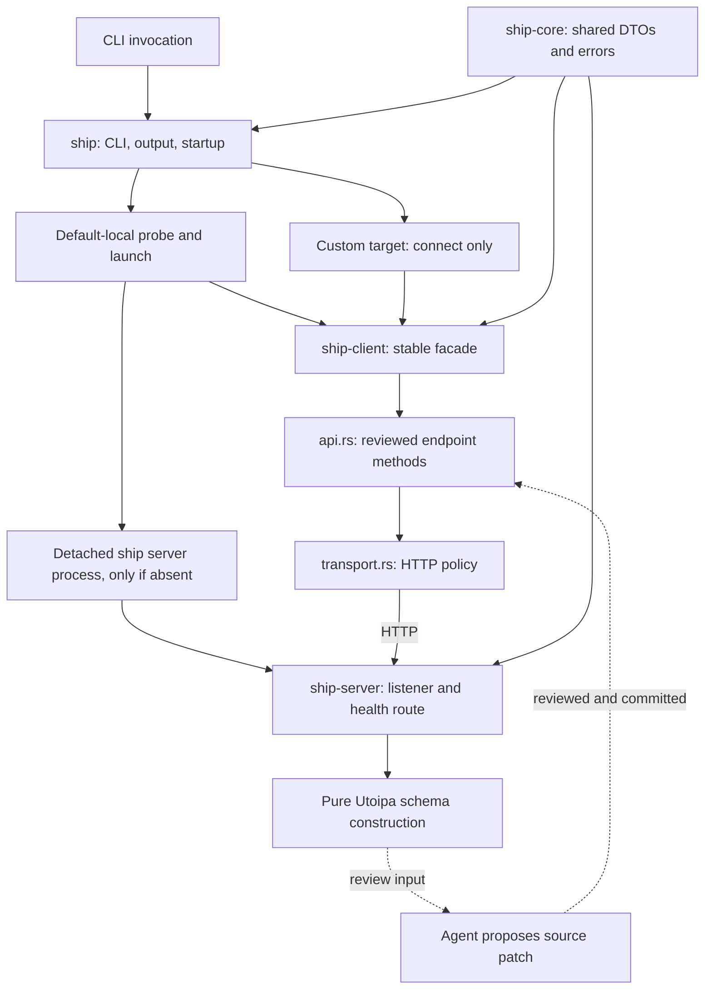
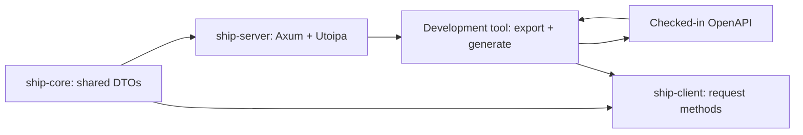
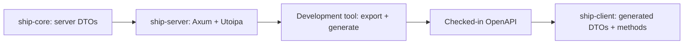
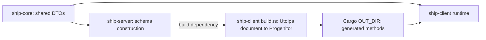
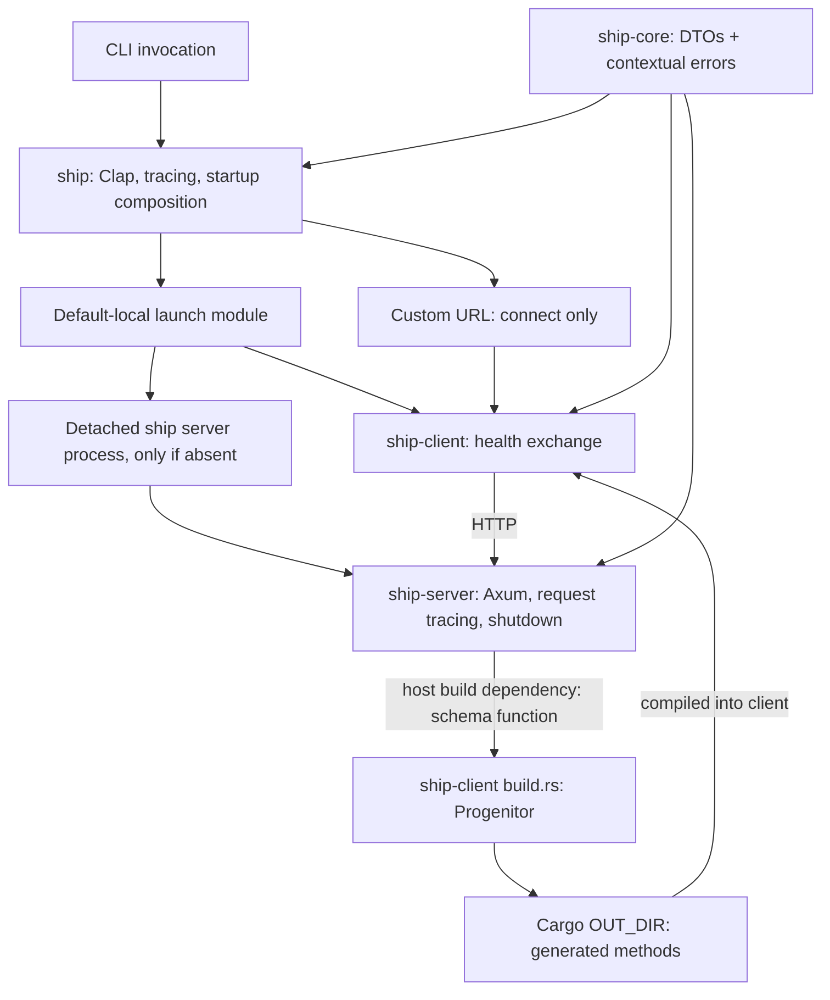

# Initial scaffolding architecture

Status: reopened for review. Audience: mixed. Cyan authorized replacing the deterministic-codegen trial with an agent-authored client. [product.md](product.md) and this paper require renewed approval; [program.md](program.md) is a downstream draft. The prior locked architecture is preserved in the superseded record below. Approval does not authorize implementation.

## Context and constraints

Ship has planning documents and a standalone terminal-transport experiment, but no accepted production Cargo workspace yet. The incomplete untracked skeleton is not an approved baseline. The experiment remains independent: do not import its dependency patches, build requirements, or benchmark code into scaffolding.

Keep four crates: `ship`, `ship-client`, `ship-server`, and `ship-core`. The app owns CLI/startup composition. Client and server share core DTOs but do not depend on each other's implementations at runtime or build time. Core holds genuinely shared types and contextual error helpers, not a speculative framework.

The revised product retains independently verified local slices, automatic default-local startup with server survival after client exit, explicit startup, custom targets with no fallback, and normal shutdown. The final slice now proves schema/client agreement and an agent-assisted update workflow, not deterministic generation. CI, deployment, authored automated tests, terminals, SSE and compression remain excluded.

Exact shared Rust DTO identity remains required. Utoipa 6.0.0 is the schema-authoring choice, without an older-version pin imposed by a client generator. Clap, Tokio, tracing/tracing-subscriber and the contextual AppError direction remain unchanged. Verify only the available development environment; unavailable checks are reported rather than assumed.

## Candidate shapes

### D: Agent-authored client methods over shared DTOs: selected for now

Store thin request methods in one ordinary Rust module, initially `ship-client/src/api.rs`. An agent reads shared DTOs, server declarations, the exported schema and existing client conventions, then proposes targeted source edits. Accepted Rust is reviewed and checked in. Cargo compiles that fixed source; no model, schema-to-client generator, freshness tool or special regeneration marker runs in a normal build.

Transport policy stays in a separate module. Client/startup callers use a stable facade rather than depending directly on the endpoint implementation file. This lets a future deterministic generator replace the method-authoring mechanism without taking ownership of process startup.

### C: Shared DTOs with build-time Progenitor generation: superseded

This was the locked choice, retained verbatim below. It remains a future option, but the current Utoipa/Progenitor format mismatch and integration work no longer block this checkpoint. Selecting it again would require an explicit decision and new feasibility evidence.

### A and B: Other earlier generation shapes: not selected

The earlier explicit/check-in generation shape and duplicate generated-model shape remain recorded below. Neither is current scope. Duplicate models do not satisfy exact DTO identity merely because they serialize to similar JSON.

## Decision

Choose **D: agent-authored, checked-in request methods over shared DTOs** for now. Keep Utoipa 6 for server schema descriptions without translating those schemas into the internal Rust client during builds.

This is an intentional scope revision, not a claim that the earlier codegen acceptance scenarios succeeded. AI authoring may produce different patches on repeated attempts; the accepted source and locked dependencies are fixed inputs to ordinary Cargo builds. Do not claim byte-identical binaries across different toolchains/environments or automatic client/schema synchronization.

Reconsider deterministic generation when repeated API drift, repetitive updates, or verification cost make the current approach expensive. File length alone is not a migration trigger. A trigger calls for a new comparison and approval; it does not authorize adopting a generator, fork, conversion layer, external tool or duplicate DTOs automatically.

## Structure

### Selected runtime and development shape

The dashed edges describe development work, not runtime or build execution.

- **ship:** the only production executable. Parses arguments, initializes tracing once per process, selects client/server mode, owns local launch, and separates stdout results from diagnostics.
- **Default-local launch module:** probes positive absence, launches the same executable detached, waits for compatible readiness within fixed bounds, and leaves a ready daemon running after client exit. Custom targets never enter this module.
- **ship-client facade:** preserves caller-facing health and local-probe behavior. Shared identity validation and default-local absence detection are not agent-invented endpoint policy.
- **api.rs:** agent-authored endpoint methods using shared DTOs directly. No copied models, alternate serializers, process management or transport-policy changes merely to update a route.
- **transport.rs and target handling:** own the configured Reqwest client, URL resolution/redaction, redirect refusal, bounded health requests, exact status expectations and contextual error translation. No global future-streaming policy.
- **ship-server:** owns loopback listening, health route, request tracing and signal-driven shutdown. Its pure schema function can be used for inspection without listener startup; the client does not depend on it.
- **ship-core:** owns Serde DTOs, their Utoipa schema descriptions, identity/version constants and the structured AppError pattern. No HTTP listener or child-process ownership.

## Key decisions

1. **Keep the four production crates and workspace build profiles.** Use the already agreed layout, centralized dependency versions, and an application lockfile. Define development, release, and test profiles at the workspace root: development favors unoptimized application code, incremental builds and usable backtraces; build-time tooling may be optimized separately. Release favors optimized, compact binaries with full LTO, one codegen unit, stripped symbols and abort-on-panic. Test inherits development and favors incremental builds with many codegen units; defining it does not authorize authored tests. Exact development debug-information and platform-specific settings belong in the program paper. Reject unrelated package-specific optimization overrides, extra release variants without a demonstrated need, a single production crate, or extra generic transport/framework crates.

2. **Use Axum and Reqwest for the health exchange.** Tokio provides async execution. Tower HTTP request tracing is the only initial HTTP middleware requirement. Reject speculative CORS, compression, buffering, global timeouts, retry policies, and authentication machinery. Give health/startup operations bounded waits locally; this is not a future streaming policy.

3. **Use one health interface with identity and compatibility information.** The response identifies Ship and its interface version, using a shared Rust DTO. Both startup probing and the user-visible health operation use it. A successful TCP connection or arbitrary HTTP 200 is insufficient to reuse a server. This is accidental-mismatch detection, not authentication against a malicious local process.

4. **Use a fixed default loopback endpoint.** Keep the default address and health-interface version shared rather than independently hardcoding them in client and server. The explicit server mode may select a different port but must still bind loopback, enabling the custom-URL/port acceptance exercise. Reject ephemeral default ports and discovery records for now. Exact port, route, field names, and CLI spelling are recorded in the program paper before implementation.

5. **Default-local startup is probe, launch if absent, then await readiness.** Only a positively absent listener permits launch. Timeout, incompatible identity, invalid response, or occupied address is an error, not permission to replace or stop an existing process. If two clients race to launch, only one listener can win; both may accept a compatible ready server, and the losing child must not remain running. Readiness waits are bounded and distinguish child failure from startup still in progress. Reject unconditional launch, endless retries, and PID-based replacement.

6. **Background startup must detach from the invoking terminal.** Establish an independent Unix session and disconnect inherited terminal input/output, rather than merely dropping a child handle. Send daemon diagnostics to a user-private local log and include its location in startup failures; explicit server mode logs to stderr. Use the same installed executable for the child. Reject shell-based launch commands, terminal-inherited daemon logs, and silently discarding daemon errors. Normal shutdown uses SIGINT/SIGTERM; no management API or supervisor is introduced.

7. **Custom targets never launch a server.** Accept HTTP/HTTPS base URLs and ports; preserve the selected target when reporting errors, without exposing embedded credentials. Reqwest uses normal certificate verification for HTTPS; no insecure TLS option is added. Reject fallback to localhost, automatic remote startup, and automatically following redirects to a different server target. This does not add remote deployment or server TLS termination.

8. **Keep tracing process-local and preserve the structured error pattern.** Initialize tracing once per process, with an environment-controlled filter and useful defaults. Core owns AppError, categorized error codes, the shared Result alias, context/reporting helpers, and the construction macros. Client and server translate their own library errors into that shared representation. No other project's source or terminology is required to understand this contract.

   - **Internal errors:** an owned-or-static message, a category, optional structured JSON data, and an optional nested AppError cause. Context adds an internal wrapper while preserving the underlying category and cause.
   - **External errors:** a category, optional structured JSON data, and a foreign error retained either as a string or a shared full diagnostic report. Display/serialization renders that report as text; sharing a report does not make arbitrary foreign errors serializable.
   - **Categories:** validation, not found, conflict, configuration, network, rate limited, upstream HTTP status, internal, serialization, unauthorized, and I/O. Keep status mapping explicit. Do not add actor-system categories or third-party integrations that this checkpoint does not use.
   - **Encoding:** AppError uses the `source` discriminator with `internal`/`external` values. Error categories use a `kind` discriminator and optional `data` for payloads such as an upstream status. Internal objects contain `message`, `type`, optional `data` and optional `caused_by`; external objects contain `code`, `error` and optional `data`. Omit absent optional values. For example, an internal network error can serialize as `{ "source": "internal", "message": "Could not connect to the server", "type": { "kind": "Network" } }`. This is the shared diagnostic representation, not authorization to expose full internal reports through HTTP responses.
   - **Ergonomics:** retain `err!` for categorized construction with formatted messages and optional data/cause, `bail!` for an early error return, and `ensure!` for a checked condition. Result helpers support adding context and reporting at error/warn/debug/trace levels with caller location. Avoid repeatedly logging the same propagated failure at every layer.

   Reject message-string heuristics when a structured error/status is available, unrelated integration conversions, manually mirrored categories per crate, and a telemetry platform. HTTP response policy stays server-owned; the health-only slice does not introduce a general public error catalog.

9. **Use ordinary source for endpoint methods.** Begin with one private `api.rs` module; split into a directory only when responsibilities warrant it. Both people and agents may edit this source. Do not mark it auto-generated/do-not-edit because no generator reproduces it. Future genuine generated artifacts retain their own no-manual-edit rule; Cargo.lock remains Cargo-owned.

10. **Keep Utoipa schema construction without a client build dependency.** Use Utoipa 6.0.0 to describe shared DTOs and the health route. Server exports a pure schema-construction function for review/verification without sockets, tracing initialization or async tasks. No `ship-client/build.rs`, server build dependency, `OUT_DIR` client inclusion, installed schema-export command, or checked-in generated client is added. A temporary inspection harness may call the pure function for manual verification; it is not a persistent developer tool or automated test suite.

11. **Make the agent-assisted update contract explicit.** Author/update only the affected method using the corresponding DTOs and server route/schema. Preserve transport and public facade contracts unless a separately approved change needs them. Review method/path/query/header/body/status agreement and Serde behavior. Compile incompatible shared-type consumers, exercise the request against the corresponding server, and record evidence. Method/route changes are not automatically synchronized, and a successful build alone proves neither wire compatibility nor endpoint existence.

12. **Verify runnable slices, not authoring claims.** Foundation ends with executable help and local checks; health ends with the real exchange and lifecycle acceptance; the final slice adds schema descriptions/export and proves the documented update workflow. No final swap to generated methods. Agent-authored source uses ordinary workspace lints, with no generated-code exceptions. Existing formatting, restrained Clippy, build, local logging and manual verification constraints remain unchanged.

## Risks and unknowns

- **Client drift is now explicit maintenance work.** Shared types catch some incompatible Rust uses, not all wire mismatches. Paths, query/header encoding, expected status, optional/null semantics and custom Serde behavior still require review and live verification. Missing client updates are possible; no automatic freshness guarantee is claimed.
- **Agent patches need boundaries.** A model may change policy, duplicate DTOs or introduce retries while completing an endpoint task. The update instructions prohibit those changes without separate approval. Source review and behavior checks are required; confidence in the author is not evidence.
- **Schema export is documentation, not the client source of truth.** Compare the schema to actual server Serde behavior and route declarations. Exporting OpenAPI 3.1 does not make its full JSON Schema semantics mechanically enforced by the client.
- **Dependency compatibility remains unverified.** Proposed versions are constraints until Cargo resolves and the local checks and runtime exercises pass. Keeping Utoipa 6 does not establish arbitrary schemas, generic types, streaming support or platform parity in Ship.
- **Detachment remains platform-sensitive.** Linux/macOS session separation, redirected handles, private logging and bounded child cleanup need real process evidence. The program paper settles the proposed launch details; no unsafe launch plumbing or cross-platform parity claim.
- **Fixed endpoint collisions and loopback trust limits remain.** Incompatible/unhealthy listeners are never killed or replaced. Concurrent clients must leave at most one serving daemon and no idle losing children. Identity/version checks are accidental-mismatch detection, not authentication.
- **Reapproval is still required.** The new direction is authorized for drafting, but the affected papers must pass review before implementation begins. Missing OpenSpec proposal/design/spec/task artifacts remain untouched.

### Future deterministic-generation options

These are evaluated possibilities, not current tasks or verified Ship integrations. Source observations below do not substitute for builds or requests. Preserve direct shared DTO identity, ordinary transport policy and the stable facade when evaluating a replacement.

| Option | Potential fit | Cost or unresolved gate |
| --- | --- | --- |
| `openapi-to-rust` | Rust library API for in-memory OpenAPI 3.1 analysis and generation; plausible future `build.rs` integration without Java or a separately installed CLI. | Named existing-model replacement is not implemented in the inspected revision. It normally emits its own models. Need a reviewed substitution feature and live shared-type proof; do not patch generated files. |
| Progenitor with older Utoipa | Utoipa 4.2.3 emits 3.0.3, matching Progenitor 0.15.0's version gate and existing-type replacement mechanism. | Downgrades server schema tooling, losing newer schema collection/generic improvements and dedicated Axum integration. Not selected merely to satisfy a generator. |
| Progenitor with 3.1 support | Preserve Rust-native library generation and explicit shared-type replacements. | Parser/schema/operation migration plus regression coverage, not just a version-check edit. An unmerged fork exists; its general support and passing behavior are not established here. |
| OpenAPI Generator Rust/Reqwest | Established external generator with configurable mappings/templates. | Java/JAR provisioning and external-process build integration. Relevant 3.1 coverage and exact named Rust-type reuse remain unproved; avoid owning custom templates without demonstrated value. |
| Narrow deterministic generator authored with AI assistance | Could encode Ship's actual repeated endpoint conventions while keeping build output deterministic. | Would become a maintained generator. No implementation until enough real repetition justifies its scope, validation and ownership. |

### Generator evidence and builder caveats

- **Utoipa/Progenitor mismatch:** Utoipa 6 exposes 3.1/default and 3.2/opt-in, not 3.0 output ([version enum](https://docs.rs/utoipa/6.0.0/utoipa/openapi/enum.OpenApiVersion.html)). Progenitor 0.15.0 rejects document versions not starting with `3.0.` ([version gate](https://github.com/oxidecomputer/progenitor/blob/v0.15.0/progenitor-impl/src/lib.rs)). Avoiding 3.1-only authored features does not remove that gate. Relabeling the document is not a general schema conversion.
- **Utoipa downgrade cost:** 4.2.3 emits 3.0.3 ([docs](https://docs.rs/utoipa/4.2.3/utoipa/openapi/enum.OpenApiVersion.html)); newer releases improve schema collection, generic handling and Axum route/document binding ([macro changelog](https://github.com/juhaku/utoipa/blob/master/utoipa-gen/CHANGELOG.md), [Axum changelog](https://github.com/juhaku/utoipa/blob/master/utoipa-axum/CHANGELOG.md)).
- **Progenitor is maintained, but version fit is separate:** its [changelog](https://github.com/oxidecomputer/progenitor/blob/main/CHANGELOG.adoc) records substantive releases and dependency updates. The [3.1 issue](https://github.com/oxidecomputer/progenitor/issues/1268) and [WalletConnect migration PR](https://github.com/WalletConnect/progenitor/pull/1) show a possible parser port, not a proved integration. Progenitor's schema adapter and [Typify reference/dialect limitations](https://github.com/oxidecomputer/typify/issues/579) make broad 3.1 support more than accepting a new version label.
- **`openapi-to-rust` inspection is pinned to `977d0873462c98f13043eff2a2ac4eb11c2e5ceb`:** its [library API](https://github.com/gpu-cli/openapi-to-rust/blob/977d0873462c98f13043eff2a2ac4eb11c2e5ceb/src/lib.rs) supports in-memory generation, and [manifest](https://github.com/gpu-cli/openapi-to-rust/blob/977d0873462c98f13043eff2a2ac4eb11c2e5ceb/Cargo.toml) allows disabling default CLI features. The source/test/CI infrastructure warrants investigation, not claims of release stability or Ship compatibility.
- **Its `type_mappings` setting does not currently solve named model reuse:** the inspected [configuration](https://github.com/gpu-cli/openapi-to-rust/blob/977d0873462c98f13043eff2a2ac4eb11c2e5ceb/src/config.rs) stores it, but generation has no consumer of that field. Active scalar-format settings use the separate TypeMapper/types configuration. [Object generation](https://github.com/gpu-cli/openapi-to-rust/blob/977d0873462c98f13043eff2a2ac4eb11c2e5ceb/src/generator.rs#L1969-L2023) has no external-model override lookup.
- **A possible extension is an alias, not a verified workaround:** replacing the emitted model with `pub type HealthResponse = ship_core::HealthResponse;` would preserve Rust type identity for references to that name. It still needs analysis of references, dependency declarations, generated helpers and trait assumptions. No generated output may be manually patched to fake this feature.
- **Operation builders are optional and disabled by default:** `[generator.builders] enabled = false` omits additive operation builders ([configuration](https://github.com/gpu-cli/openapi-to-rust/blob/977d0873462c98f13043eff2a2ac4eb11c2e5ceb/src/config.rs), [client generation](https://github.com/gpu-cli/openapi-to-rust/blob/977d0873462c98f13043eff2a2ac4eb11c2e5ceb/src/client_generator.rs)). Enabled builders can assume body `Default`, a generated `new(...)` constructor and writable optional fields. Externally supplied DTOs may not meet those assumptions. An initial external-model trial should disable operation builders and accept complete bodies; a complete feature should handle external models explicitly. Fluent HTTP-client configuration methods are a different mechanism.
- **External generator cost:** the [installation docs](https://openapi-generator.tech/docs/installation/) allow a pinned Java JAR without npm/Docker, but [Rust backend coverage](https://openapi-generator.tech/docs/generators/rust/) still has limitations. A larger tool does not by itself prove relevant 3.1 behavior or shared-type mapping.

No generator, fork, alias feature or conversion path was built or exercised in this design work.

## Superseded decisions

The entire previous locked architecture is preserved below. Its selected shape C, build dependency, OUT_DIR generation and acceptance instructions are historical and no longer authorize implementation.

Previous locked architecture: in-process Progenitor generation

# Initial scaffolding architecture

Status: locked. Approved by Cyan after review. Product scope is locked in [product.md](product.md). Changes to this paper require renewed approval and reopen any downstream program paper; locking this design does not authorize implementation.

## Context and constraints

Ship has planning documents and a standalone terminal-transport experiment, but no production Cargo workspace yet. The experiment remains independent: do not import its dependency patches, build requirements, or benchmark code into scaffolding.

The accepted production layout is `ship`, `ship-client`, `ship-server`, and `ship-core`. The app owns CLI/startup composition. Client and server have no runtime dependency on each other's implementations; the client has a build-time dependency on the server's schema-export interface. Core contains genuinely shared types and error helpers, not a speculative framework.

The locked product requires independently verified local slices, automatic default-local server startup with survival after client exit, explicit server startup, custom URLs with no fallback, and a final working codegen trial. CI, deployment, authored automated tests, terminals, SSE and compression are excluded. Existing first-terminal planning contains superseded synchronization choices and is not authority for this checkpoint.

Cyan selected exact shared Rust DTO identity as the driving codegen constraint. Clap, Tokio, tracing/tracing-subscriber, and the contextual AppError direction are already preferred. Verification starts on the available development environment; unavailable platform checks are reported, not assumed.

## Candidate shapes

### A: Shared DTOs with explicit generation: superseded

Author wire DTOs in core, describe the server interface with Utoipa, export OpenAPI without starting the server, and use Progenitor with existing-type replacements to generate request methods into the client. Check in generated artifacts and verify freshness with an explicit developer command. This was the initial recommendation, but adds a developer tool, committed outputs and a separate freshness check. Cyan preferred tying generation to the normal binary build, which already includes server and client. Retain this as a possible future alternative, not the selected scaffolding shape.

### B: Independent generated client DTOs: rejected

Keep server DTOs in core, but let Progenitor generate client DTOs as well as request methods from the exported schema. Generation and startup otherwise work as in A. This exercises the schema independently and avoids replacement mappings, but creates distinct Rust types and eventual conversion work. At ten times the interface size, duplicate models and conversions grow even where the wire shapes are identical; it loses Cyan's chosen exact-type constraint.

### C: Shared DTOs with in-process build-time generation: selected

Expose schema construction from the server and make the server a build dependency of the client. The client's build script calls that function without starting a listener, then uses Progenitor with shared-type replacements to write request methods into Cargo's build-output directory. No separate developer tool or checked-in generated files are needed. The main binary already includes both server and client, so server compilation is not an otherwise unnecessary part of that workflow. The remaining cost is host-side build dependencies, generator work and possible future native-build coupling; those are reasons to measure and revisit, not to add an alternate generation path now.

## Decision

Choose **C: shared DTOs with in-process build-time generation**. Exact Rust type reuse with fewer development steps matters most: one normal build constructs the schema from current server declarations and generates request methods, without duplicate DTOs, a separate tool or committed generated outputs.

This supersedes the initial recommendation of A after Cyan's review. The trial remains a trial. If the selected generator cannot satisfy the product acceptance scenarios, stop for Cyan's decision; do not treat A, B or a handwritten final client as an authorized fallback.

## Structure

### Selected runtime and development shape

Key:

- **ship:** the only production executable. Parses arguments, initializes process-level tracing, dispatches client/server execution, and owns the default-local launch module. Application results go to stdout; diagnostics do not.
- **Default-local launch module:** checks whether the default local server is running. If no server is listening, it starts one in the background and waits for a compatible health response. If startup fails, it reports the failure and log location. It never creates terminal sessions or starts a server when a custom URL was supplied.
- **ship-client:** owns URL handling and the health exchange. First uses a minimal handwritten HTTP call; the final slice replaces that call with the generated request method. Generated implementation stays isolated from caller-facing startup behavior.
- **ship-server:** owns the HTTP listener, health route, request tracing, compatible-server identification, and graceful signal-driven shutdown. It also exposes schema construction without listener startup. It imports neither the client nor generator tooling, keeping the dependency graph acyclic.
- **ship-core:** owns the shared Serde DTOs, their schema descriptions, and the structured AppError/Result/context pattern described below. No PTY, UI, listener, or child-process ownership.
- **ship-client build script:** added in the final codegen slice. Cargo builds the server as a host-side build dependency; the script calls its schema function and runs Progenitor. Generated methods are written under Cargo's OUT_DIR and compiled into the target-side client, referencing its normal ship-core dependency. Neither this script nor the generator runs when an installed Ship binary starts.

## Key decisions

1. **Keep the four production crates and workspace build profiles.** Use the already agreed layout, centralized dependency versions, and an application lockfile. Define development, release, and test profiles at the workspace root: development favors unoptimized application code, incremental builds and usable backtraces; build-time tooling may be optimized separately. Release favors optimized, compact binaries with full LTO, one codegen unit, stripped symbols and abort-on-panic. Test inherits development and favors incremental builds with many codegen units; defining it does not authorize authored tests. Exact development debug-information and platform-specific settings belong in the program paper. Reject unrelated package-specific optimization overrides, extra release variants without a demonstrated need, a single production crate, or extra generic transport/framework crates.

2. **Use Axum and Reqwest for the health exchange.** Tokio provides async execution. Tower HTTP request tracing is the only initial HTTP middleware requirement. Reject speculative CORS, compression, buffering, global timeouts, retry policies, and authentication machinery. Give health/startup operations bounded waits locally; this is not a future streaming policy.

3. **Use one health interface with identity and compatibility information.** The response identifies Ship and its interface version, using a shared Rust DTO. Both startup probing and the user-visible health operation use it. A successful TCP connection or arbitrary HTTP 200 is insufficient to reuse a server. This is accidental-mismatch detection, not authentication against a malicious local process.

4. **Use a fixed default loopback endpoint.** Keep the default address and health-interface version shared rather than independently hardcoding them in client and server. The explicit server mode may select a different port but must still bind loopback, enabling the custom-URL/port acceptance exercise. Reject ephemeral default ports and discovery records for now. Exact port, route, field names, and CLI spelling are recorded in the program paper before implementation.

5. **Default-local startup is probe, launch if absent, then await readiness.** Only a positively absent listener permits launch. Timeout, incompatible identity, invalid response, or occupied address is an error, not permission to replace or stop an existing process. If two clients race to launch, only one listener can win; both may accept a compatible ready server, and the losing child must not remain running. Readiness waits are bounded and distinguish child failure from startup still in progress. Reject unconditional launch, endless retries, and PID-based replacement.

6. **Background startup must detach from the invoking terminal.** Establish an independent Unix session and disconnect inherited terminal input/output, rather than merely dropping a child handle. Send daemon diagnostics to a user-private local log and include its location in startup failures; explicit server mode logs to stderr. Use the same installed executable for the child. Reject shell-based launch commands, terminal-inherited daemon logs, and silently discarding daemon errors. Normal shutdown uses SIGINT/SIGTERM; no management API or supervisor is introduced.

7. **Custom targets never launch a server.** Accept HTTP/HTTPS base URLs and ports; preserve the selected target when reporting errors, without exposing embedded credentials. Reqwest uses normal certificate verification for HTTPS; no insecure TLS option is added. Reject fallback to localhost, automatic remote startup, and automatically following redirects to a different server target. This does not add remote deployment or server TLS termination.

8. **Keep tracing process-local and preserve the structured error pattern.** Initialize tracing once per process, with an environment-controlled filter and useful defaults. Core owns AppError, categorized error codes, the shared Result alias, context/reporting helpers, and the construction macros. Client and server translate their own library errors into that shared representation. No other project's source or terminology is required to understand this contract.

   - **Internal errors:** an owned-or-static message, a category, optional structured JSON data, and an optional nested AppError cause. Context adds an internal wrapper while preserving the underlying category and cause.
   - **External errors:** a category, optional structured JSON data, and a foreign error retained either as a string or a shared full diagnostic report. Display/serialization renders that report as text; sharing a report does not make arbitrary foreign errors serializable.
   - **Categories:** validation, not found, conflict, configuration, network, rate limited, upstream HTTP status, internal, serialization, unauthorized, and I/O. Keep status mapping explicit. Do not add actor-system categories or third-party integrations that this checkpoint does not use.
   - **Encoding:** AppError uses the `source` discriminator with `internal`/`external` values. Error categories use a `kind` discriminator and optional `data` for payloads such as an upstream status. Internal objects contain `message`, `type`, optional `data` and optional `caused_by`; external objects contain `code`, `error` and optional `data`. Omit absent optional values. For example, an internal network error can serialize as `{ "source": "internal", "message": "Could not connect to the server", "type": { "kind": "Network" } }`. This is the shared diagnostic representation, not authorization to expose full internal reports through HTTP responses.
   - **Ergonomics:** retain `err!` for categorized construction with formatted messages and optional data/cause, `bail!` for an early error return, and `ensure!` for a checked condition. Result helpers support adding context and reporting at error/warn/debug/trace levels with caller location. Avoid repeatedly logging the same propagated failure at every layer.

   Reject message-string heuristics when a structured error/status is available, unrelated integration conversions, manually mirrored categories per crate, and a telemetry platform. HTTP response policy stays server-owned; the health-only slice does not introduce a general public error catalog.

9. **Generate from the server's current Rust declarations during the client build.** Utoipa describes the shared DTO and server route. The server exposes a schema-construction function; the client's build script calls it directly without starting a listener or fetching over HTTP. Progenitor generates request methods with explicit existing-type replacements to core. Stable operation identifiers control generated method names. Reject a separate codegen tool, schema-first duplicate authored models, and a checked-in schema as the generation input.

10. **Use Cargo build outputs, not checked-in generated files.** Write generated methods and any schema artifact needed for inspection under OUT_DIR; never hand-edit or commit those outputs. Normal builds perform generation when Cargo runs the build script and compile the resulting methods into the client. Cargo tracks the Rust build dependencies; explicitly declare any additional external inputs used by the script. The final-slice verification must demonstrate that changing server declarations causes generation to rerun and changes the output on the next normal build. Reject manual regeneration as a prerequisite, a separate freshness-check command, and treating a shared-type compilation failure alone as evidence that generation reran. If build-time generation becomes annoying later, a feature can select a path that skips generation, but that path must supply an alternative source for the generated methods; no such feature or alternate output source is added now.

11. **Prove both generation and shared-type correctness.** Demonstrate the real generated health request. Exercise a shared DTO field/type change, confirm that export reflects the changed wire shape, and demonstrate the incompatible caller failing compilation. Also change the operation identifier so regeneration changes the method interface and the old generated-method call fails compilation. Reconcile the caller and repeat the real request with the changed declaration before restoring the intended baseline. A shared DTO field change alone is insufficient evidence for generation because core can break callers without regeneration. The real request and exported-schema inspection also check the external type mapping; generator replacement is not assumed to validate arbitrary Serde representations.

12. **Verify runnable slices, not disconnected layers.** Foundation ends with a working executable/help and local checks; the health slice ends with exercised explicit/automatic startup, reuse, custom URL behavior, logging and shutdown; codegen is the final replacement of the working call. Formatting, restrained Clippy and build checks remain local. Generated-code lint exceptions, if required, stay confined to generated output. Reject CI/deployment setup, permanent test scaffolding, and beginning the next slice before evidence for the current one is recorded.

## Risks and unknowns

- **Generator feasibility remains unproven in Ship.** Primary-source capability checks are not the product's build-and-request proof. Utoipa's [OpenApi trait](https://docs.rs/utoipa/latest/utoipa/trait.OpenApi.html) supports in-process schema creation; Progenitor 0.15.0's [GenerationSettings](https://docs.rs/progenitor-impl/0.15.0/progenitor_impl/struct.GenerationSettings.html) supports existing-type replacements. The [client-support manifest](https://docs.rs/crate/progenitor-client/0.15.0/source/Cargo.toml) uses Reqwest 0.13.4 with default features disabled, so the workspace must align Reqwest and deliberately enable HTTPS support. These are inspected capabilities, not selected version pins or a completed Ship integration. Exact compatible versions, support crates and replacement syntax must be recorded during program design and exercised in the final slice. The operation-identifier naming behavior must also be confirmed against the selected release. Failures stop for a decision, not an unauthorized tool substitution.
- **Shared types can hide schema mismatches.** A replacement reuses a type; it does not independently prove the server declaration, schema and Serde representation agree. In-process schema construction removes the separately maintained schema input, but the declaration-change rebuild, schema inspection and live generated request are still required for the current flat health DTO. Success here does not establish support for arbitrary enums, attributes, generics, or later streaming interfaces.
- **Host/target compilation can duplicate server work.** The main binary includes server and client, but build dependencies compile for the host while the binary compiles for the target. Cross-compilation, differing features/profiles, or later native terminal dependencies may add another server/native build. Accept that coupling for scaffolding and measure it when those dependencies arrive. A future feature-controlled alternate generation path is an escape hatch, not current implementation work.
- **Detachment is platform-sensitive.** Linux/macOS require independent session establishment, redirected handles and bounded readiness. The concrete launch primitive and log-directory handling must be resolved in the program paper; do not implement unsafe process-launch plumbing or claim platform parity without review and evidence.
- **A fixed endpoint can collide or serve the wrong process.** Fail safely on incompatible/unhealthy listeners; do not kill or replace them. Ten simultaneous client starts must converge on one compatible listener or bounded errors, not create ten persistent daemons. This remains a manual behavior check, not a new permanent test suite.
- **Loopback is not a trust guarantee.** Other local processes can imitate the identity response. Authentication is outside the locked checkpoint, and identity/version checks must not be represented as a security boundary.
- **Startup bounds and generated-output details remain program decisions.** Resolve numeric waits, endpoint/CLI/schema spelling, compatible versions, build-script input tracking and generated-output inclusion, and narrowly scoped lint treatment before code is written. Do not leave them to an implementing agent to silently infer.
- **Rollback preserves the working foundation, not the final acceptance claim.** The handwritten health slice is a verified earlier checkpoint, so a failed generator trial can stop without losing startup behavior. Removing codegen or accepting handwritten calls as the final result requires Cyan to reopen the product paper and downstream designs.

