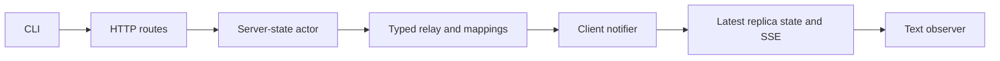
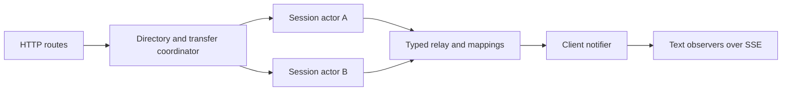
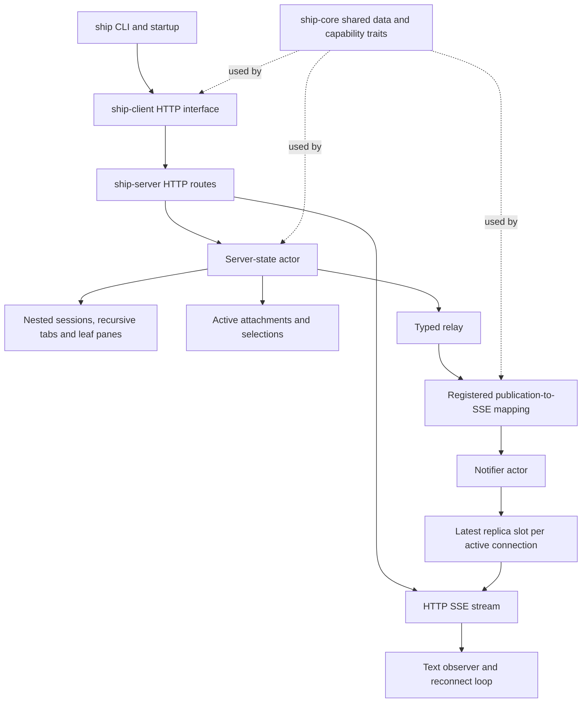
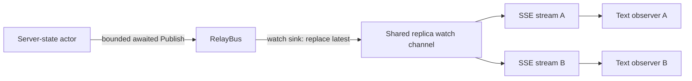

# Session/tab roundtrip architecture

Status: Locked again on 2026-10-06 after Cyan read [amendment A5](#amendments-2026-10-06) and approved it in chat ("they're good to go"). Previously: Locked again on 2026-10-05. Cyan approved amendments A1 to A3 and then A4 in Plannotator, each with “LGTM”. The previous revision was approved in Plannotator with “Looks good to me!”; its text is kept and the parts it supersedes are marked. It implements the approved logical-pane scope in the locked [product paper](product.md), superseding the earlier session/tab-only architecture scope and GET-based attachment opening. Shape A and the decisions below are approved architecture; this paper does not authorize code changes.

## Context and constraints

- Existing Ship code supplies the Cargo crate separation, Clap entry points, local server startup, loopback Axum health route, Reqwest request handling, tracing and shared errors. Session/tab/pane structure, actor ownership and streaming replication are new work.
- The locked product requires recursive ordered tabs, tab-owned logical leaf panes, cross-session tab moves, recursive removal, independent client selections, machine-readable entity creation results and gap-free recovery. Observation is text-only. Pane layouts, independent pane moves/reordering and live terminal resources are outside this change.
- Retain the agreed UUID-backed typed IDs, kind-prefix function, composable identity/creation traits and untagged either parent representation. These describe relationships independently of storage and transport.
- Use Kameo actors and the historical typed relay/sink pattern. Producers publish typed internal messages; subscription mappings define client delivery. The SSE wire vocabulary is an enum, not a type-name trait or generated schema registry.
- All state is in memory. Preserve the existing loopback restriction and health behavior; no authentication or non-loopback exposure is added. IDs identify objects, not authorized callers.

## Candidate shapes

### A. One state owner with typed relay and notifier — selected

One state actor owns the complete nested structure and active attachment records. Cross-session edits and selection repairs commit together without coordinating competing owners. The relay maps internal publications to notifier messages, while stream delivery stays outside the state actor. The cost is serialized metadata mutation; expensive snapshot copying or publication can limit throughput, so socket writes and compression must never run in this actor.

### B. Session actors with transfer coordinator — rejected for this slice

A directory dispatches ordinary edits to independently owned sessions. A coordinator transfers subtrees between owners. Independent session throughput improves, but cross-session changes and their selection repairs need an explicit transaction/failure protocol. If one actor fails after another detaches a subtree, recovering ownership is substantially more complex than a local metadata commit.

## Decision

Choose **A**, as selected by Cyan in the tradeoff discussion. Simple ownership and indivisible cross-session moves matter more than independent metadata throughput for this slice; session actors would add failure coordination without demonstrated need.

## Structure

The notifier boxes in these diagrams are superseded by [A3](#amendments-2026-10-05): replicas reach streams through a shared watch channel subscribed to the relay.

### Ownership and delivery

Key:

- **CLI/startup:** existing process composition plus session/tab/pane commands and text observation. JSON entity results go to stdout; diagnostics and connection-status messages go to stderr.
- **Shared data:** serializable sessions/tabs/panes, typed IDs, capability traits, request payloads, session snapshots, attachment viewing records, replica envelopes and `SseEvent`. No actor references, channels or future PTY handles are serialized.
- **State actor:** authoritative nested metadata, active attachment identity/selection, validation, commits, revision assignment and publication. Read requests cross the same ownership interface; callers receive owned snapshots, not mutable references.
- **Relay/mappings:** typed internal publication and registration-time conversion into notifier messages. Does not own session structure or decide fallback policy.
- **Notifier:** *(superseded by A3)* active connection registrations and latest outgoing replica slots. Does not perform structural mutations or repair selection independently.
- **SSE stream:** consumes the latest slot, frames textual events and applies HTTP compression. It owns no authoritative state.
- **Text observer:** replicated session structure and server-owned attachment viewing records, plus local disconnection status and remembered selected ID; one centralized reconnect loop. It matches its own attachment ID to a viewing record and derives its displayed view from that record and the structure. It does not independently decide authoritative selection or optimistically edit shared structure.

## Key decisions

1. **Nested ordered ownership.** Use nested `IndexMap` collections for sessions and tab children. Each tab also owns a flat pane collection, independent of its child tabs; panes are named leaf metadata and own no descendants or runtime resources. Pane collection storage does not introduce a pane-reordering API or layout semantics. Find ID-only targets by traversal initially; do not add a second authoritative parent map or speculative global index. Order-preserving tab removal/repositioning is intentional, even though it can shift entries. Moving a tab carries its pane collection and all descendant tabs' panes unchanged; recursive removal removes those panes with their owning tabs. Flat global entity maps and fixed workspace/tab levels are rejected.

2. **Composable typed identity and parent relationships.** `Identified` associates an entity with its ID; `IdOf<T>` is the shared alias. `Creatable` associates the entity with its parent entity and creation input. A reusable untagged either implements identity by mapping its inner entity to the corresponding typed ID. A tab's parent is a session-or-tab choice; a pane's parent is strictly a tab, not that either choice. Root session creation uses the unit identity of a named server-root concept. No independent per-entity ID aliases or special untyped destination strings are needed. Prefix display/parsing/Serde all use the same stable kind-prefix function and strict validation.

3. **Operation-specific HTTP routes; shared internal payloads.** HTTP routes expose individual operations and return operation-specific results. The server may wrap those payloads in the agreed entity action enums for dispatch; a universal external `/action` endpoint is unnecessary. Generic create/move/rename/remove payloads and capability traits remain reusable internally. Reject both duplicated CLI business logic and a generic entity trait that forces unsupported operations onto every type.

   Approved route surface, relative to the existing server base URL:

   | Operation | Route | Successful result |
   | --- | --- | --- |
   | List sessions | `GET /sessions` | Ordered session collection |
   | Create session | `POST /sessions` | `201`, created session |
   | Inspect/rename/remove session | `GET`, `PATCH`, `DELETE /sessions/{id}` | Entity for reads/rename; `204` for removal |
   | Create tab | `POST /tabs` | `201`, created tab; body identifies session-or-tab parent |
   | Inspect/rename/remove tab | `GET`, `PATCH`, `DELETE /tabs/{id}` | Entity for reads/rename; `204` for removal |
   | Move/reorder tab | `POST /tabs/{id}/move` | Moved tab, including its panes |
   | Create pane | `POST /panes` | `201`, created pane; body identifies its tab parent |
   | Inspect/rename/remove pane | `GET`, `PATCH`, `DELETE /panes/{id}` | Entity for reads/rename; `204` for removal |
   | Attach and observe | `POST /attach` | Compressed textual SSE; first event returns assigned attachment ID and current replica state |
   | Select session/tab/pane | `PUT /attach/selection` | Updated attachment viewing record; selection must belong to attached session |
   | Switch active attachment's session | `PUT /attach/session` | Updated attachment viewing record, selecting that session root |

   Session/tab inspection includes their contained panes, providing pane listing without a separate global pane-list route. Pane creation and removal are metadata-only; they neither start a terminal nor change child tabs. No pane move, reorder or layout endpoint is introduced.

   The streaming attach request uses a JSON body to identify the desired session and may supply the observer's previously selected session/tab/pane ID for recovery. Reqwest consumes the POST response as an SSE stream; browser-native GET-only `EventSource` is not the client transport. Every stream opening receives a new attachment ID; closing the stream ends that attachment. Selection and session-switch controls carry `X-Ship-Attachment-Id`, not an attachment path parameter. An observer can set this on its own control-request context, replacing it after each new stream handshake; independent observers must not share that context. The initial stream request does not require this header. There is no attachment/view inspection endpoint: clients derive their views from replicated structure and server-owned viewing records, identifying their own record by the attachment ID. Ordinary entity inspection remains on the session/tab/pane routes. There is no separate client-resource creation, expiry timer or explicit deletion endpoint.

   A custom Axum `FromRequestParts` extractor requires and parses the attachment header without consuming the JSON request body. Missing or malformed headers return `400`; the state actor, not the extractor, validates that the ID addresses an active attachment, returning `404` for an ended or unknown attachment.

   Ordinary successful JSON operations use `200` except entity creation. Errors use the existing error categories with server-owned HTTP mapping: malformed input `400`, missing target `404`, conflicting session name `409`, invalid structural relationship/placement `422`, and unavailable server machinery `503`. Exact Rust signatures and command parsing belong in the program paper.

4. **Creation returns the entity itself.** CLI creation prints the returned serializable session/tab/pane as JSON, so `jq -r '.id'` obtains its ID. The representation is the same entity data included in client snapshots. It describes the committed result at that moment, not a promise that later mutations cannot change it. No ID-only DTO, event correlation or universal action-result union is required at this interface.

5. **Validated metadata commit.** Validate identity, parent kind/existence, session-name uniqueness, placement and self/descendant tab moves before committing. Duplicate tab/pane names remain valid, and pane creation accepts only a tab parent. For this metadata-only slice, edit candidate copies of the affected session or sessions, derive selection repairs from the old and candidate trees, and swap the result into authoritative state only after validation succeeds. No partial detachment survives failure. Move placement names a sibling in the destination; absent placement appends. Ownership edits contain no external side effects. Cloning these descriptions is not a proposed future method for cloning PTYs or runtime owners.

6. **Active attachment selection belongs to the state owner.** *(Unattached state superseded by A1.)* Store one most-specific session/tab/pane selection per active attachment, plus its attached session or unattached state. The attached session is subscription context, not a duplicated full selection path. Within-session moves preserve selection by ID; cross-session moves repair source attachment selections before publication. Explicit session switching resets selection to the new root. Removing a selected pane falls back to its owning tab when that tab survives; recursive tab removal continues fallback through surviving tab ancestors to the session. Selection of panes within moved subtrees follows the same within-session retention and cross-session fallback rules as tab selection. Removal uses the locked surviving-parent policy. The server owns the viewing records; the client derives a displayed view rather than owning a competing selection state. Returning an attachment ID is not authentication, and ordinary entity commands need no attachment header.

7. **Attachment lifetime is stream lifetime.** *(Session-removal and missing-session behavior superseded by A1; notifier bookkeeping by A3.)* Opening `POST /attach` assigns a fresh attachment ID and registers its selection/stream. A drop guard initiates idempotent removal of that exact attachment from state and notifier bookkeeping when the stream ends. Rust `Drop` cannot await actor cleanup; initiation is lifetime-bound, while actor processing completes asynchronously. Registration must also clean up if the HTTP request is cancelled before the stream is returned. No disconnected server-side identity, expiry timer or replacement-generation protocol is needed. A reconnect opens a new attachment using the locally remembered session and most-specific selection. Retain that selection only if it still belongs to the requested session; otherwise fall back to the surviving session root, including when the selected tab or pane moved to another session with its owning subtree. This reconnect rule is distinct from surviving-parent repair for an active observer. A missing session yields an unattached viewing record. Removing a session leaves its existing stream open but unattached, so a control request can switch that same observer to another session. Two observers and overlapping reconnect streams have distinct IDs; old cleanup cannot delete a new attachment.

8. **Replicate state; derive the view on the client.** *(Unattached records and session-removal representation superseded by A1; the coalesced update slot is the shared watch channel per A2; a final stream-local end event added by A5.)* A self-contained replica envelope carries session structure including logical panes, server-owned attachment viewing records, server incarnation and revision. A viewing record identifies the attachment, its attached session or unattached state, and its most-specific selection. The observer finds its own record by matching the attachment ID from the handshake, then derives what to display from that record and the session structure. A server-assembled per-client view and a separate view-fetch endpoint are unnecessary. A delivered envelope must include the receiving observer's current record, including when unattached, and the structure needed to resolve its selection. The first SSE event is an `Attached` variant with the assigned attachment ID and captured replica state; subsequent `State` events replace the complete replicated state. Both variants use named payload types. Preserve the first event separately from the coalesced update slot so a quick mutation cannot hide the assigned ID/initial handshake. Share immutable session snapshot data internally across observers where useful. Session removal is represented by replicated unattached state rather than a one-off event that can be lost during coalescing. Independent terminal-screen events belong to the terminal change, not now.

9. **One ordering domain, no patch replay.** Use a fresh server-incarnation UUID and a monotonically increasing server commit revision. Snapshot envelopes carry both; revisions may skip because unrelated operations and coalescing occur. Within an incarnation, clients reject older revisions and accept newer complete replica envelopes. Initial stream state establishes a new baseline after a server restart. Do not compare revision numbers across incarnations or import patch-base/`Last-Event-ID` replay requirements. A revision alone does not establish gap-free attachment.

10. **Attach, subscribe and seed in one stream opening.** *(Notifier registration and seeding superseded by A2 and A3; ID creation by A4.)* For `POST /attach`, the state actor assigns the attachment ID, resolves the initial selection, captures current replica state including the attachment's viewing record, and asks the notifier to register/seed the outgoing slot before allowing the next structural command to execute. The HTTP stream first emits the returned `Attached` frame, then consumes coalesced `State` updates. Older already-queued publications are rejected by the slot's incarnation/revision check. Subsequent committed publications reach the registered attachment through the reliable relay path. Changes to viewing records, including explicit selection/session switching and automatic selection repair, are authoritative state changes and use the same revision/publication ordering as structural edits. Session switching delivers the destination structure and updated viewing record together, so the observer can derive its new view without fetching it. There is no separate snapshot-request/subscription gap. The notifier never calls back into the state actor, avoiding an actor wait cycle.

11. **Reliable relay hop, replaceable stream delivery.** *(Relay-to-notifier hop superseded by A2.)* Reuse typed subscriptions and initialization-time map/filter adapters, not the historical silent drop on a full actor mailbox. For authoritative replica publications, both the state-to-relay and relay-to-notifier hops use bounded, awaited delivery; failures are surfaced and actor failure triggers coordinated server shutdown rather than silently continuing with stale observers. The notifier replaces a connection's latest replica slot, using Tokio's latest-value/watch behavior rather than a FIFO of snapshots. A stream waiting on change is woken when the final value is replaced, even if no new mutation arrives. Socket stalls cannot block the notifier. This intentionally allows intermediate replica states to be skipped; it does not claim to retract bytes already buffered in HTTP/compression/TCP.

12. **Centralized reconnect and transport compression.** The text observer handles SSE EOF/body failure in one reconnect loop, reports disconnection, and retries with bounded exponential backoff up to five seconds between attempts. This loop does not replay mutations. Use Reqwest's safe request retry support where applicable; it does not replace established-stream recovery. Approved codec policy is negotiated zstd with gzip available, explicit Tower SSE compression eligibility and Reqwest streaming decoding. Automatic zstd decoding must be demonstrated in the real client path before acceptance; the synthetic probe's explicit decoders are not that proof. Keep serialization/compression outside the state owner; keepalives do not advance state revisions.

### Amendments (2026-10-05)

Agreed with Cyan during program design. These replace only the marked parts of decisions 6, 7, 8, 10 and 11 and the notifier in the structure diagrams.

**A1. Removing a session ends its attachments; the server is ID-only.** A viewing record always names a session and a most-specific selection; there is no unattached record or client state. When a commit removes a session, it also deletes every viewing record attached to that session, and each such stream ends once the latest replica no longer lists its attachment ID. `POST /attach` takes a session ID and fails with `404` if that session does not exist. The observer reattaches after any stream end using its remembered session ID; a `404` means the session was removed, so it reports that and exits (product P1). *(For a stream that ends because its session was removed, superseded by A5: the observer exits without reattaching.)* Session switching for a live attachment (`PUT /attach/session`) is unchanged.

Session names stay out of the server API (product P2 to P4). Every route keeps taking IDs. `ship-client` resolves a session name to an ID with `GET /sessions` before calling the ID-only route. Attach-or-create is also client-side: look up the name, create it if absent, and on `409 Conflict` from a concurrent creator look it up again, then attach by ID. Server-side session name validation rejects `:` in create and rename. No name index, name-addressed route or name in any stored record exists.

**A2. Replicas reach streams through a watch channel subscribed to the relay.** The relay is a close port of an earlier project's `RelayBus` and sink adapters (`Sink`, `SinkExt::{filter, filter_map}`, typed `Subscribe`/`Publish`). A `tokio::sync::watch::Sender<Arc<Replica>>` is subscribed as the replica sink. Publishing replaces the channel's single value, so it can never be full and never drops the latest state. The state-to-relay hop stays a bounded, awaited actor send. Each `POST /attach` stream clones a receiver, emits `Attached` with the state actor's seed, then emits `State` for every replica whose revision is newer than the seed, skipping stale values still in flight. Mailbox-backed sinks such as a kameo `Recipient` drop on a full mailbox and may carry only non-authoritative events. Relay actor failure still triggers coordinated server shutdown; streams end when the watch sender is dropped.

**A3. No notifier actor in this change.** The shared watch channel replaces per-connection slots and registration, and the state actor no longer registers or seeds anything outside itself during attach. The server's shared Axum state holds the actor refs and a replica receiver. A client notifier with per-connection queues returns when the first queued, non-authoritative event type exists; each stream then merges its watch receiver with its own queue.

**A4. The attach route creates the attachment ID.** *(Supersedes "the state actor assigns the attachment ID" in decision 10.)* `POST /attach` creates the ID and its cleanup guard before asking the state actor to register it. If the request is cancelled at any point, including while the state actor is replying, the guard still knows which ID to detach. The state actor rejects a duplicate ID. Observable behavior is unchanged.

### Amendments (2026-10-06)

Proposed during slice 6 review. A5 adds to decision 8 and A1 and replaces only the part of A1 marked above.

**A5. The stream says why it ends.** `SseEvent` gains a last variant, `Ended(EndReason)`, sent immediately before the server closes the stream:

- `Ended(SessionRemoved)` when the first replica newer than the seed no longer lists the stream's attachment. The observer prints `session removed` and exits 0 without reattaching.
- `Ended(ServerShutdown)` when the replica watch sender is dropped during shutdown. The observer reports the disconnection with that reason and reattaches with backoff, as for any other end.

An EOF or body error without `Ended` still means the connection dropped, and the observer reattaches. The reattach `404` still detects a session removed during an outage, because the observer never sees an `Ended` event it was disconnected for.

Decision 8 rejected "a one-off event that can be lost during coalescing". `Ended` is not that kind of event. It is never published through the relay or stored in the watch channel. Each stream derives it from the latest replica it reads, the same check that already ends the stream, so coalescing cannot drop it. Replicated viewing records stay the source of truth, and `Ended` only labels the close. It can be lost with the connection, which is why the `404` path stays.

Why: without a reason, a clean end of stream looks like a dropped connection. In slice 6, an observer whose session was removed printed `disconnected: attach stream ended; retrying in 250ms`, waited, and only learned the truth from the reattach `404`. A future client UI also needs the reason. The `SseEvent` schema in the OpenAPI document gains the variant. Product behavior is unchanged.

## Risks and unknowns

- **At 10x metadata load:** candidate cloning and serialized commits may dominate. First measure the actual workflow. Sharing immutable snapshots and reducing copied affected state are smaller changes than distributing ownership. Revisit session actors only with demonstrated demand; no throughput claim is made here.
- **Backpressure:** bounded awaited actor delivery trades silent loss for pressure on metadata commands. A wedged relay (notifier superseded by A3) can delay actions, but not because it awaits a client socket. Actor shutdown propagation and bounded server shutdown must be wired deliberately. Once state commits, a machinery failure cannot be presented as proof that the command never happened; ambiguous transport failures are not automatically replayed.
- **Attachment lifecycle:** cleanup must cover normal stream drop, failed registration and cancellation before the HTTP stream is returned. The guard initiates asynchronous cleanup; server shutdown must not require those actor messages to run after their actors have already stopped. The five-second retry ceiling is an approved architecture default, not a product requirement.
- **Text-client control:** *("can become unattached without exiting" superseded by A1.)* selection/session-switch requests carry the active observer's attachment ID from the first event in `X-Ship-Attachment-Id`. The observer prints each newly assigned ID, refreshes its isolated control-request context on reconnect, and can become unattached without exiting; program design must provide a usable same-process session-switch workflow. A stream ID is deliberately not stable across reconnects, so stale control requests fail rather than target a replacement attachment. The client derives its view by matching its own ID to a replicated server-owned viewing record; it does not need a view-inspection route.
- **Compression:** Tower excludes SSE by default; permitting it is explicit. The loopback benchmarks favor zstd on repetitive synthetic data but do not prove automatic decoding, production-network performance or universal compression ratios. If the real path fails, return to architecture review before changing the selected codec policy; do not silently add a custom compressor.
- **Future terminals:** panes in this paper are metadata-only leaf entities, not tab aliases, PTY owners or layouts. They reuse identity/CRUD capabilities while keeping tab-only parenthood and unsupported child/move operations explicit. Candidate copies must not become runtime copies; future process resources need explicit ownership separate from serializable pane descriptions. Terminal processing must not become blocking work inside the state actor.
- **Security:** existing loopback exposure remains unauthenticated. Prefixed IDs and attachment IDs provide addressing, not access control. Non-loopback or untrusted-client exposure requires a separate design.
- **Compatibility:** prefixed ID strings and serializable entity responses become external contracts. Changing prefixes or representation later needs deliberate compatibility handling; phantom typing does not remove that cost.
- **Evidence and portability:** the required relay behavior is recorded in the local [typed relay contract](../../../../docs/research/typed-relay.md), with no dependency on private repositories. Transport evidence is summarized in [the handoff](../../../../docs/research/terminal-transport-handoff.md). These are source/design and scratch-probe evidence, not verified Ship actor/stream integration. Actual Rust reuse/integration belongs to implementation; no permanent tests or code changes are authorized by this architecture draft.
