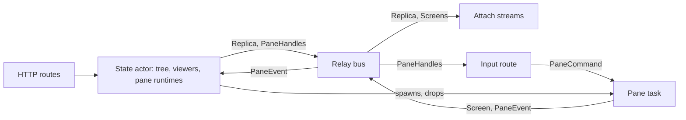
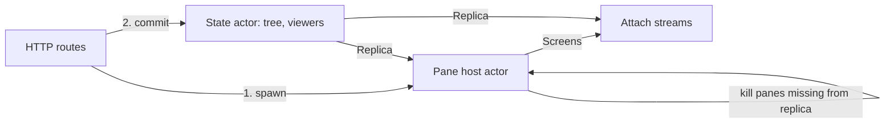
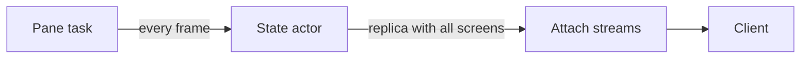
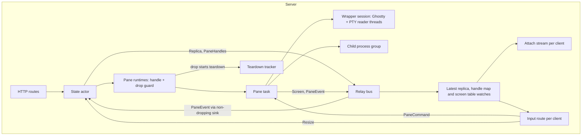
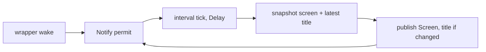
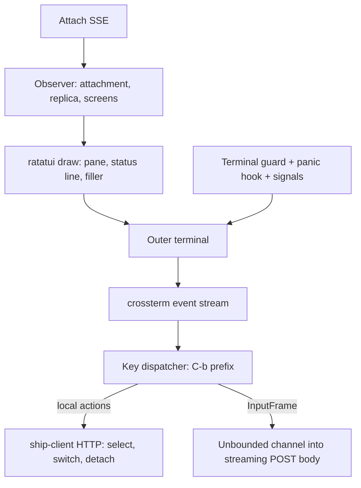

# Pane terminals architecture

Status: Locked on 2026-10-06. Cyan approved it in Plannotator with "LGTM". It implements the locked [product paper](product.md). Decisions come from the 2026-10-06 grilling, the [transport probe](../../../../../docs/research/pane-terminals-transport-probe.md) and the architecture discussion. Shape A and the decisions below are approved architecture; implementation waits for the locked program paper. Amended on 2026-10-06 during program review: Cyan approved amendments A1 to A6 in chat ("let's make all of these proposed fixes!"). They're recorded in [Amendments](#amendments) and override the decisions they name. Session text in this paper is superseded by the drop-sessions change (2026-10-08), which replaces sessions with top-level tabs; it is kept as written and marked where a requirement defines sessions.

In short: the state actor keeps owning everything structural and now also owns each pane's running program. Each pane gets a task that runs the terminal and publishes its screen, title and exit code on the relay bus, paced to one publish per frame. Clients get screens on the existing attach stream and send input on one streaming POST. Keystrokes and screens never pass through the state actor.

## Context and constraints

- **Repo reality.** One Kameo state actor (`crates/ship-server/src/state.rs`) owns the session tree and viewing records and changes them through `commit`. It clones, edits, repairs selections, bumps the revision and publishes an `Arc<Replica>` on the `RelayBus` (`crates/ship-core/src/relay.rs`). A `watch` subscribed at startup carries replicas to attach streams (`crates/ship-server/src/attach.rs`). Those are compressed SSE with zstd or gzip and a 15 s keepalive. The client (`crates/ship/src/observe.rs`) is a text observer with stdin controls that this slice deletes. Shutdown stops the actors, which ends the streams, and is bounded at 5 s (`lib.rs:159`).
- **Live resources stay private to the server.** PTYs, children, Ghostty objects and tasks never cross the boundary. Clients get descriptions and screen contents.
- **Rent the mechanisms:**
  - PTY: `portable-pty` 0.9.0.
  - Terminal emulation and the per-pane session thread: the `ratatui-ghostty` wrapper, vendored into `vendor/` with PROVENANCE, on `libghostty-vt` from crates.io. The build needs Zig and network access.
  - Transport: axum, reqwest and tower-http.
  - Keys: crossterm types through serde remote mirrors.
- **What the wrapper gives us.** `SessionHandle::spawn` takes a PTY reader, writer and resizer plus a `wake` callback. It runs a session thread and a reader thread. After each batch of PTY output it renders into a shared ratatui `Buffer` and calls `wake`. It reports `TitleChanged` and `Exited` through `poll_event`, and it encodes keys and bracketed pastes against the terminal's live modes (`send_key`, `send_paste`). It doesn't own the child process.
- **Transport evidence** (probe, macOS loopback):
  - streamed POST chunks arrive at once and in order;
  - a raw `Body` isn't capped by `DefaultBodyLimit`;
  - zstd SSE doesn't hold events back;
  - axum's `http2` feature serves HTTP/1.1 and h2c on one listener;
  - the remote key mirrors get utoipa schemas.
- **Bus evidence** (macOS). The real `RelayBus` moved 1 to 1.5 million messages a second unpaced. With 50 panes publishing at frame pace, it carried about 5,400 a second, and the worst wait on its full mailbox was 0.67 ms. When titles weren't paced, the `Recipient` sink into an actor that republishes on every message dropped 61 to 96% of them. Paced, it dropped none.
- **Hard limits:**
  - about 20k lines of implementation Rust (vendored code excluded);
  - zero authored tests;
  - Linux and macOS are priorities, Windows best effort;
  - loopback only, no auth;
  - snappier than tmux.

## Candidate shapes

### A. The state actor owns pane runtimes; panes publish on the bus (selected)

`commit`'s edit starts the program, so a pane exists only if its program started. Removal drops the runtime in the same commit, and the drop runs teardown. Each pane task publishes screens, titles and its exit code on the bus at frame pace. Input goes from the route straight to the pane task, found through a handle map the state actor publishes. Cost: a fork and exec (milliseconds) runs inside the actor and briefly delays other edits. Failure mode: a teardown path that never runs leaks a process. Every path starts from one drop, so that's the place to audit.

### B. A separate pane host that reconciles against the replica (rejected)

The state actor stays pure metadata. A host actor starts programs before the commit, and kills any program whose pane is missing from the replica. Creation becomes two steps with an undo. The host can also see a replica that doesn't yet contain a pane it just started and reap it, so it needs a pending set or epochs to close that race. That is the same cross-owner coordination the roundtrip rejected for session actors, and it only pays off if spawning becomes slow.

### C. Screens ride in the replica (rejected)

Pane tasks hand screens to the state actor, which publishes them inside the replica. The client gets one stream and one apply path. But every output frame clones and republishes the whole state through the actor that also serves every command, and every client gets every pane's screen. A sustained `cat` would make commands feel slow, which fails SC-007.

## Decision

Choose **A**. Atomic pane creation (FR-001: nothing changes if the program can't start) comes for free when the actor that commits the pane also starts its program. Keystrokes and screens bypass that actor, so commands stay fast. B buys freedom from syscalls in the actor at the price of cross-owner coordination, and C fails on performance.

## Structure

### Server ownership and flow

Key:

- **HTTP routes:** CRUD routes as today, plus the streaming input POST. They talk to the state actor with asks and never touch runtimes directly.
- **State actor:** owns the tree, viewing records and the runtime map, keyed by pane ID. In `commit`, adding a pane starts its program, and a failed start fails the whole edit. After the swap, `retain` drops runtimes whose panes are gone. It publishes `Replica` and, when runtimes change, `PaneHandles`. It applies `PaneEvent`s (title, exit) to pane metadata and republishes. It computes tab sizes and sends resizes.
- **Pane runtime:** the handle (an unbounded command sender) plus a drop guard. Dropping it cancels the pane task, which runs teardown.
- **Pane task:** one per pane, a tokio task. It owns the wrapper `SessionHandle`, the child, and the child's process group ID. It forwards commands to the session without awaiting the PTY. It runs the capture loop and publishes `Screen` and paced titles. It publishes `PaneEvent::Exited` once when the child exits, and a removal notice for the screen table when it ends.
- **Wrapper session:** the vendored ratatui-ghostty thread pair. It parses output, keeps the rendered buffer, encodes keys and pastes, and calls `wake`.
- **Relay bus:** unchanged. It fans out typed publications to sinks and does no pacing or throttling of its own.
- **Watches:** each is one sink subscribed at startup:
  - the latest replica (as today);
  - the latest pane handle map;
  - a screen table holding the latest screen per pane, with a per-pane sequence number.

  Streams and routes read these watches. They never ask the state actor on the hot path.
- **Attach stream:** sends `Attached`, then wakes on replica or screen-table changes. It sends `State` when the replica changes and `Screen{pane, screen}` for each pane of the selected tab whose sequence number moved. It ends as today.
- **Input route:** checks the attachment, then reads NDJSON `InputFrame`s and routes each by its pane ID through the handle map. Frames for unknown panes are dropped. Resize goes to the state actor.
- **Teardown tracker:** tracks running teardowns so server shutdown can wait for them within its existing bound.

### Pane task capture loop

Key: `wake` stores at most one permit. The loop waits for a permit, then for the interval tick, then snapshots and publishes. A change after a quiet period goes out at once. Sustained output goes out at most once per frame, and the final state is always sent. Exit codes and removal notices skip this loop.

### Client

Key:

- **Key dispatcher:** handles the fixed `C-b` keys from FR-008. Everything else, and `C-b C-b`, becomes a `Key` frame for the selected pane. Pastes become `Paste` frames. Resizes become a `Resize` frame, latest wins per frame.
- **Observer:** owns the attachment, replica and screens. `apply` then `reconcile` is the only path that writes server-owned state. It prunes screens for panes missing from the replica. While disconnected it keeps everything and the dispatcher discards input frames.
- **Draw:** converts the selected pane's `Screen` into a ratatui buffer. It draws at the tab's size in the top-left corner, then the dim filler, then the status line, or the empty-state hint when no pane is selected. Labels come from the replica.
- **Terminal guard:** raw mode and alternate screen go on at start and are restored on every exit path: normal end, error, panic hook, SIGTERM and SIGHUP.

## Key decisions

1. **The state actor owns pane runtimes, and the program starts inside the commit.** (Amended by A6.) The edit closure gets a candidate that holds the cloned sessions, the viewers and the newly started runtimes. Adding a pane through the candidate is the only way to start one. Rejected: a separate pane host (shape B), and starting the program after the commit (that leaves a pane without a program).
2. **Removal and shutdown run through one drop.** (Amended by A1.) Dropping a runtime cancels its pane task, which then:
   - closes the master (SIGHUP);
   - gives the program 2 s;
   - SIGKILLs the process group;
   - reaps.

   Teardowns are tracked, and server shutdown waits for them inside its existing 5 s bound. Rejected: killing synchronously inside `commit`, which would block the actor for up to 2 s.
3. **Pane tasks publish on the bus.** `Screen`, `PaneEvent::{Title, Exited}` and a removal notice are typed publications, matching the roundtrip's relay pattern. Rejected: per-pane `watch` channels held in the handle (the grilling sketch), and messages sent straight to the state actor.
4. **The pane task paces screens and titles.** Each loop waits for a change (a `Notify` permit), then an interval tick with missed ticks set to `Delay`, then publishes. The frame interval is one constant (16 ms), and it becomes configurable with the config slice. The bus does no throttling. Rejected:
   - `sleep` after each publish, which drifts by the capture time;
   - an interval alone, which wakes idle panes 60 times a second and delays echo;
   - the interval's default `Burst`, which sends back-to-back frames after idle;
   - bigger mailboxes, which only postpone drops.
5. **Exit codes never drop.** `PaneEvent` reaches the state actor through an unbounded channel sink. A small forwarder task drains it with an awaited `tell`, so it waits rather than drops. Titles are already paced, so the queue stays short. Rejected: the `Recipient` sink, which drops when full, and the probe showed it drops under bursts.
6. **Screens reach streams through one server-wide table.** A sink subscribed at startup writes the latest screen per pane, with a sequence number, into a `watch`. A new or switching stream gets current screens immediately, including from quiet panes. Rejected: a sink per attach stream, which only sees future publishes, so a quiet pane would stay blank after attach. Also rejected: a `StreamMap` of per-pane watches, which goes away with decision 3.
7. **Streams carry every pane of the selected tab.** Only one pane shows in this slice, but splits come next and switching panes then needs no round trip. Rejected: only the selected pane, cheaper now and reworked next slice. See risks.
8. **Screens are full snapshots.** `SseEvent::Screen{pane, screen}`: `Screen` is an owned grid of keyed JSON `Cell`s plus the cursor, defined in ship-core. The stream's zstd compression supplies the savings across frames, which matches the transport handoff evidence. Rejected: diffs and patches (history).
9. **Input is one streaming POST per attachment.** (Amended by A4.) `/api/v0/attach/input` takes an NDJSON body of `InputFrame::{Key{pane,key}, Paste{pane,text}, Resize{cols,rows}}`, read with `StreamReader` and `FramedRead<LinesCodec>` at a 64 KiB maximum line. The client sends through `reqwest::Body::wrap_stream` over an unbounded channel, using a request helper without the 2 s timeout. The server checks the attachment before reading the body. The loop ends when the attachment ends or the server shuts down: it selects on replica changes. Keys are encoded on the server against the terminal's live modes. Rejected:
   - WebSockets (they bypass OpenAPI and middleware);
   - one POST per key (ordering needs a single request in flight);
   - client-side byte encoding (the client can't see terminal modes).
10. **Key wire format is serde remote mirrors in ship-core.** (Replaced by A5.) The mirrors of crossterm's `KeyEvent`, `KeyCode`, `KeyEventKind`, `MediaKeyCode` and `ModifierKeyCode` derive utoipa schemas. The tuple variants carry `with` and `value_type` on the variant. The bitflags fields use one generic `with` helper that writes flag names. Rejected: a hand-written key type, and crossterm's own `serde` feature (no schemas, and bitflags serialize as opaque strings).
11. **Size: the smallest viewer of each tab.** (Amended by A3 and A4.) `Resize` updates the attachment's viewing record in the state actor. After each commit, the actor computes each viewed tab's smallest size minus the status line and sends `Resize` to that tab's panes when it changed. A tab nobody views keeps its last size, because nothing resizes it. A new pane starts at its tab's current size: the smallest viewer, else a sibling's size, else 80x24. Rejected: largest wins, per-client sizes, and resizing on focus.
12. **Pane metadata in the replica.** `Pane` gains `command`, `cwd`, `title` and `status` (running, or exited with a code). Tab and pane `name` become optional, and empty or whitespace-only input normalizes to none at deserialization. Clients derive labels. `PROTOCOL_VERSION` goes to 2.
13. **Program defaults.** (Amended by A2.) `Create<Pane>` takes an optional command and cwd. The CLI always sends its current directory. A missing command means the server's `$SHELL`, else `/bin/sh`. Attaching by a new name creates the session, its tab and its shell pane in one commit, through an optional starter pane on session creation. Children get `TERM=xterm-256color` and `COLORTERM=truecolor`.
14. **Transport settings.** axum's `http2` feature goes on the server, and the client stays on HTTP/1.1. Accepted connections set `TCP_NODELAY` through `tap_io`.
15. **The client is the attach UI.** It replaces `observe.rs` and `controls.rs` and uses ratatui with the crossterm backend. It lives in `ship-client`, with the binary only composing it, because the planning doc gives UI and input forwarding to `ship-client`. Rejected: keeping it in the binary crate next to the old observer.
16. **ratatui-ghostty is vendored into `vendor/` as a copy, not a subtree.** It comes with PROVENANCE and the local MIT notice. Vendored code doesn't count toward the line budget.

## Amendments

Approved by Cyan on 2026-10-06 during program review. The structure diagrams above still show the original design; where they disagree with an amendment, the amendment wins.

- **A1. Hangup is sent explicitly, and shutdown waits in the state actor (decision 2).** The wrapper's reader thread holds a duplicate of the master fd, so dropping the session never closes the last copy and no hangup happens. Teardown sends SIGHUP to the child's process group and the terminal's foreground group, waits 2 s, SIGKILLs both groups, reaps, and signals completion on a oneshot held by the runtime. There's no teardown tracker. Removal drops the runtime and lets teardown run in the background. Shutdown runs through the state actor's `on_stop`, which stops every runtime and awaits all their completion signals within the existing 5 s bound. Known gap, accepted by Cyan: a pane removed less than 2 s before shutdown isn't waited for, so a program there that ignores SIGHUP can survive. The kernel still hangs up every terminal at process exit (confirmed on macOS by a throwaway probe; Linux unverified).
- **A2. The server picks the default selection only on attach (decision 13 and FR-004a).** *(Session text superseded by drop-sessions.)* An attach without a selection selects the session's first pane in tree order, else the session. Session switching has no server-side rule: the client chooses the selection (A4).
- **A3. Sizes are derived, never stored (decision 11).** The only stored size is each viewer's terminal size, on its viewing record. A tab's size is the minimum over the records viewing it, minus the status line, and a pane's size is its tab's. After each commit the actor sends each viewed tab's size to its panes, and a pane task drops resizes that don't change its size. A tab nobody views gets nothing and keeps its sizes. A new pane starts at its tab's derived size, else 80x24; the "sibling's size" fallback is dropped. With layouts later, a pane's size becomes the layout's share of the tab size, using the same path.
- **A4. One view endpoint replaces selection, switch and resize (decisions 9 and 11).** *(Session text superseded by drop-sessions.)* `PUT /api/v0/attach/view` takes `{selection, size}`, the client's whole view. The server derives the session from the selection, replaces the viewing record, commits, and returns the record as stored. A selection that's no longer in the tree leaves the record unchanged and is not an error. `PUT /api/v0/attach/selection` and `PUT /api/v0/attach/session` are deleted. The input stream carries only `Key` and `Paste`. The client edits a local view and sends at most one view per frame, latest wins.
- **A5. Keys use crossterm's own `serde` feature (decision 10).** The mirrors and the bitflags helper are dropped. The OpenAPI schema describes the key as an object, and modifiers serialize as crossterm's `"SHIFT | CONTROL"` strings.
- **A6. Programs start just before the commit, with no edit candidate (decision 1).** The handler starts the program, places the runtime in the runtime map, and then commits the insert with today's `commit` signature. On both success and failure, `commit` retains only runtimes whose pane is in the current tree, so a failed edit drops and tears down the new runtime. Atomicity (FR-001) is unchanged: the pane exists only if its program started.

## Risks and unknowns

- **Screen size on the wire.** Keyed JSON cells are verbose. A 200x50 screen can run to hundreds of kilobytes uncompressed per frame, and only zstd context across frames keeps that small. Profile `cat` of a large file and Neovim scrolling. If bandwidth or CPU hurts, the fallbacks are: stream only the selected pane, use a compact cell encoding, or skip panes nobody can see.
- **The cost of the selected-tab scope at 10x.** Ten busy panes in one tab means ten screen streams to show one. Measure before splits land. Decision 7 is the knob.
- **The wrapper renders on every output batch.** Its session thread copies the terminal into the shared buffer after each read batch, not at our frame pace. Under sustained output that cost lands on the session thread. Profile, and patch the vendored copy if it shows.
- **Spawning inside the actor.** A slow `fork`/`exec` or a slow filesystem behind `cwd` delays every other edit. A burst of scripted pane creations would serialize. Move spawning out (shape B's direction) only if it's measured.
- **Teardown correctness.** Teardown has to cover every way a pane ends: a program ignoring SIGHUP, orphaned background jobs in a new process group (`setsid` inside the shell escapes `killpg`), and macOS EOF versus Linux EIO on the reader. SC-003 checks the common case. Daemonized descendants are a known gap.
- **Ordering between replica and screens.** A pane's first screen can reach the table before the replica that contains the pane. Streams filter by their current replica and rescan the table on replica changes, so this resolves itself. It has to be kept in mind during the build.
- **Resize storms.** Dragging a window emits many resizes. Each one is a state-actor commit and replica publish. The client coalesces resizes per frame. If commits still hurt, keep viewer size out of the replica.
- **Build friction.** `libghostty-vt` needs Zig and network access at build time. CI and fresh machines need both.
- **Unverified platforms.** The transport and bus evidence is macOS only. Linux has to be checked deliberately. Windows: no Job Object, the ConPTY reader can hang, and Herdr's patch 0003 suggests pane creation can fail with error 87 on some machines.
- **Rollback.** Reverting the change restores the text observer. There's no data migration, because state is in memory. Old clients fail the protocol version check instead of misreading new events.
