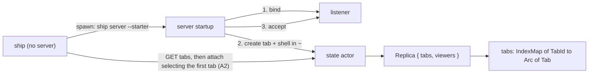
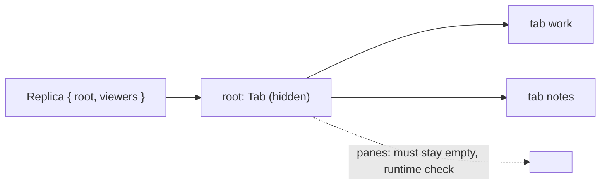
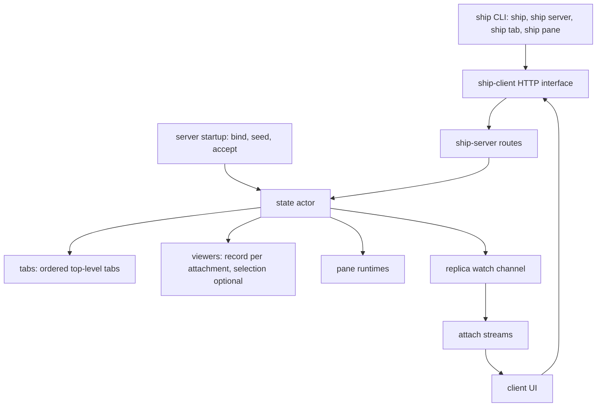

# Drop sessions architecture

Status: Locked again on 2026-10-08 with amendment A2 (opening view), which Cyan asked for in chat ("go for it!") during slice 3 and approved in chat after Plannotator review ("architecture paper looks good"). Before that, locked again on 2026-10-08 with amendment A1, which Cyan approved in chat after Plannotator review ("it's good!"). First locked on 2026-10-08: Cyan approved it in Plannotator with "LGTM". It implements the locked [product paper](product.md), including amendment A-1. Shape A and the decisions below are approved architecture; this paper does not authorize code changes.

## Summary

The server's top level becomes an ordered list of tabs, held where the session map is today. Every tab's children sit behind `Arc`, so one map type serves every level and a commit still copies only the tabs it edits. Viewing records may select nothing, so removing tabs never ends an attachment. The first tab comes from server startup: `ship server --starter` creates it after binding and before accepting connections, and bare `ship` passes the flag when it starts the server, then ~~selects that tab with the same view request `C-b )` sends~~ attaches with that tab's first pane as the selection (A2). No new route or attach behavior is needed for seeding, and opening a running server never changes it.

Needs Cyan's attention: decision 2 (`Arc` at every level, not only the top as discussed in chat) and decision 7 (a failing starter fails server startup).

## Context and constraints

- The [session/tab roundtrip](../../archive/2026-10-06-session-tab-roundtrip/design/architecture.md) and [pane terminals](../../archive/2026-10-07-pane-terminals/design/architecture.md) architectures stay in force except where this paper amends them: one state actor owns the tree, the viewing records and the pane runtimes (`crates/ship-server/src/state.rs:40`); replicas reach attach streams through a watch channel; screens stream only for the viewed tab's panes.
- Every edit runs through `ServerState::commit` (`state.rs:83`), which clones the tree, edits the clone, repairs viewing records, swaps and publishes. The clone is cheap only because each session sits behind an `Arc` (`Sessions = IndexMap<IdOf<Session>, Arc<Session>>`, `crates/ship-core/src/tree.rs:832`) and `Arc::make_mut` copies just what an edit touches. Whatever replaces sessions has to keep that cost.
- Today a viewing record always names a session (`crates/ship-core/src/protocol.rs:372`), and an attach stream ends when that session disappears from the replica (`crates/ship-server/src/attach.rs:131`). The product requires attachments to survive with nothing selected (FR-009).
- The auto-start in `crates/ship/src/local.rs:31` spawns `ship server --port … --background-child` and waits for `/health`. The server binds its listener in `crates/ship-server/src/lib.rs:124` before serving.
- Locked product facts the shapes must respect: no panes outside a tab (FR-001), lookup by ID only (FR-002), tabs created on the server's own initiative only at startup from a starter (FR-006 A-1), opening a running server never changes its tabs (SC-003 A-1).
- Loopback only, in-memory state, no saved data to migrate. Implementation Rust should shrink (SC-005).

## Candidate shapes

### A. Top-level tab list, seeded at startup (selected)

The replica's `sessions` map becomes `tabs`, the same ordered map type every tab uses for its children. A tab's parent is "a tab, or the top level", expressed as an optional tab ID. Nothing can hold a pane at the top level, because the top level is only a map of tabs. Seeding is a step in server startup, between binding and accepting, so no client can observe a half-seeded server and no two clients can race to seed it. The cost is one "or top level" branch wherever a parent is resolved (create, move, take). If the server ever needs per-server data beside the tabs, it goes on `Replica`, not on a node.

### B. Hidden root tab (rejected)

The server holds one unnamed root `Tab`, and every top-level tab is its child, so every parent is a plain tab ID and no "or top level" branch exists. But `Tab` has a `panes` field, so the root could hold panes; FR-001 forbids that, which turns a type guarantee into a runtime check on every pane create and move. The root's ID also appears in every replica and becomes the value scripts must pass for "top level". Fewer branches, weaker invariant, and a node the user never sees.

## Decision

Choose **A**. Expressing "no panes at the top level" through the type matters most, because Ship's rule is to state each invariant once in types; B trades that for removing one branch, and adds a hidden node every script must know about.

The seeding alternatives discussed before amendment A-1 (seeding inside attach, and a create-if-empty flag on tab create) are recorded in decision 6.

## Structure

| Box | Owns |
|---|---|
| server startup | Parsing `--starter`; binding the listener; asking the state actor to create the starter tab before serving. Nothing after that. |
| state actor | The tab tree, viewing records and pane runtimes, as today. Selection repair now falls back to nothing selected instead of deleting the record. |
| tabs | Ordered top-level tabs. Every level is `IndexMap<IdOf<Tab>, Arc<Tab>>`. |
| viewers | One record per attachment: optional selection and terminal size. No session field. |
| attach streams | Replica and screen delivery as today. They end only on detach (client closes) or server shutdown. |
| ship CLI | Bare `ship`: reuse or start the local server; if it started one, select the first top-level tab before the first draw. `ship tab list`, `ship server status`, `ship server --starter`. No session commands. |
| client UI | Top-level tab cycling, the nothing-selected hint, the status line without a session. |

## Key decisions

1. **The top level is an ordered map of tabs on the replica.** `Replica.sessions` becomes `Replica.tabs`. ~~Tab create and move take an optional parent; omitted or `null` means top level.~~ Superseded by A1: tab create takes an optional parent, where omitted or `null` means top level; tab move takes exactly one destination (A1). `NodeId` loses its `Session` variant. `Session`, `SessionName`, `TabParent`, `SessionRef`, `TabParentRef` and the name-resolution helpers go away, and with them the only uses of `ServerRoot` and `UntaggedEither` (`crates/ship-core/src/id.rs:117`, `:139`), which go too. Rejected: a hidden root tab (shape B).
2. **`Arc` at every level of the tree.** `Tab.tabs` becomes `IndexMap<IdOf<Tab>, Arc<Tab>>`, the same type as the top level, so move, take and place work on one map type and a tab moves between levels without being wrapped or unwrapped. An edit copies each tab on its path shallowly (its maps of `Arc`s), which is proportional to depth and sibling count, not tree size. Rejected: `Arc` on top-level tabs only, matching today's per-session `Arc`, which was the plan in chat; it needs two map types and a conversion on every move across the top level. Rejected: no `Arc`, which deep-clones the tree on every commit, including every pane title change. `Arc` is invisible on the wire; serde writes the inner value.
3. **Viewing records hold an optional selection.** `ViewingRecord { selection: Option<NodeId>, size }`. Repair keeps a selection that still exists, moves a removed pane to its neighbor as today, otherwise walks the old ancestors and takes the nearest one that still exists, otherwise `None`. A record is deleted only on detach. Tab sizes skip records with no selection. Rejected: deleting the record when nothing remains, which ends the attachment and breaks FR-009.
4. **Attach takes no container.** `AttachRequest { selection: Option<NodeId>, size }`. A requested selection is kept if it exists, else `None`; there is no first-pane fallback, because the client opens with nothing selected (FR-004). `EndReason` keeps only `ServerShutdown`, so a stream that ends without an `ended` event still reads as cut. Rejected: removing `Ended`, which loses the clean-shutdown signal.
5. ~~**The starting selection is an ordinary view change.** When bare `ship` started the server, the client attaches with no selection and then sends `PUT /attach/view` with the first top-level tab, the same request `C-b )` sends from nothing selected, before drawing the first frame. The auto-start step reports whether it spawned the server. Rejected: a selection hint in the attach request (protocol surface for one caller); having the server return the starter's ID through health or attach (couples startup output to the protocol).~~ Superseded by A2.
6. **Seeding is a startup step, not a request.** `ship server --starter` binds the listener, asks the state actor to create one top-level tab holding a pane with the default `PaneSpec` (login shell, server user's home), then starts accepting. `/health` answers only after that, so the auto-start's readiness wait also waits for the tab. Without the flag the server starts empty. Two `ship` processes starting at once each spawn a server; one bind loses and that process exits before seeding, so only the winner's tab exists, and both clients select it. Rejected: seeding during attach with a flag (attach gains a side effect, and it contradicts A-1); `ifEmpty` on tab create (needed only while opening could seed; A-1 removed that case); seeding from the client by checking for tabs and then creating one (racy, as Zellij's `attach -c` is).
7. **A failing starter fails startup.** If the starter's shell cannot start, `ship server --starter` exits with the error, and the auto-start reports it with the retained log as it does for any failed launch. Rejected: starting empty and logging, which hides a broken shell or home directory behind an empty screen.
8. **New and changed routes.** `GET /api/v0/tabs` returns the top-level tabs with their descendants (for `ship tab list`). ~~Tab create and move accept an omitted parent.~~ Superseded by A1: tab create accepts an omitted parent; tab move takes one destination. The session routes are removed. `PROTOCOL_VERSION` goes from 4 to 5, so the existing health check rejects a mismatched client and server. `ship server status` prints the health response bare `ship` prints today.
9. **Docs follow the ripple rule.** `AGENTS.md` and `GLOSSARY.md` describe top-level tabs; the session text in the archived session/tab roundtrip and pane terminals papers is marked superseded by this change, not rewritten.

## Risks and unknowns

- **10x tabs.** Lookups traverse the tree, as today, and each replica is sent whole to every stream, as today. Neither has been measured at hundreds of tabs; the replica size is the first thing to profile if the overview later shows many machines' trees. Decision 2 keeps commit copies proportional to path length.
- **Wider `Arc` use.** `Arc::make_mut` at each level of a path means `tab_mut` and the take/place helpers change shape. If the code turns out clearly larger than with top-level-only `Arc`, revisit decision 2 in the program paper's deviation log.
- **Starter timing.** Spawning the shell before accepting adds its spawn time to the auto-start's readiness wait. It has not been measured; judge it by feel in the verification runs.
- **Rollback.** Revert the branch. Nothing is saved to disk, and the protocol version bump stops an old client talking to a new server.
- **Unverified platforms.** Windows stays unverified throughout; Linux and macOS are checked through the product paper's verification steps.

## Amendments

- **A1 (2026-10-08, from program review):** A tab move names exactly one destination: a parent (`{"parent": "tab:…"}`, or `{"parent": null}` for the top level), or a sibling to go before or after (`{"before": "tab:…"}`, `{"after": "tab:…"}`), whose parent becomes the destination. Today's body names a parent and an optional placement sibling, and the server rejects a sibling outside that parent; one destination makes that error impossible instead of checking for it. The cost is that an empty move body no longer means top level: `{}` is rejected, and the top level is spelled `{"parent": null}`. Tab create keeps its omittable parent. The CLI is unchanged in what it accepts, except that `--before` and `--after` no longer take a parent beside them. This replaces the move half of decisions 1 and 8.
- **A2 (2026-10-08, from slice 3 review):** The starting selection travels in the attach request. When bare `ship` started the server, the client reads `GET /api/v0/tabs`, picks what `C-b )` would pick from nothing selected (the first top-level tab's first pane, else the tab), and attaches with it as `AttachRequest.selection`. The server keeps it if it still exists, so the first `Attached` already has it, and nothing else happens. If the tab is gone by then, the selection is dropped and the client shows the hint. The auto-start step still reports whether it spawned the server. Decision 5's rejection of "a selection hint in the attach request" was about adding a field for one caller; this reuses the field reconnects already send, and the route list stays the same. Why: decision 5's PUT after attach needed the client to hold drawing until the view landed, or it flashed the hint for a frame. That hold was one-shot state in three branches of the event loop, about 30 lines, which A2 replaces with three lines before the attach. Replaces decision 5.
