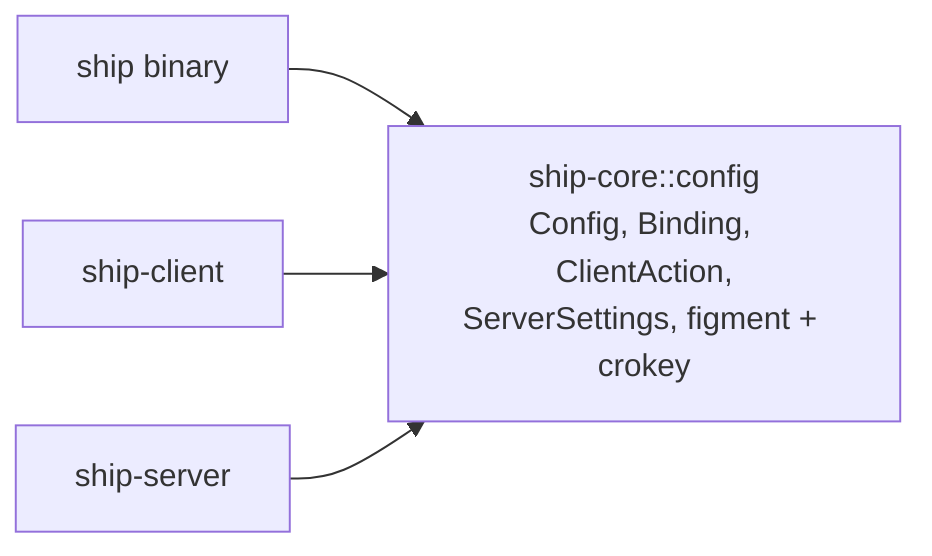
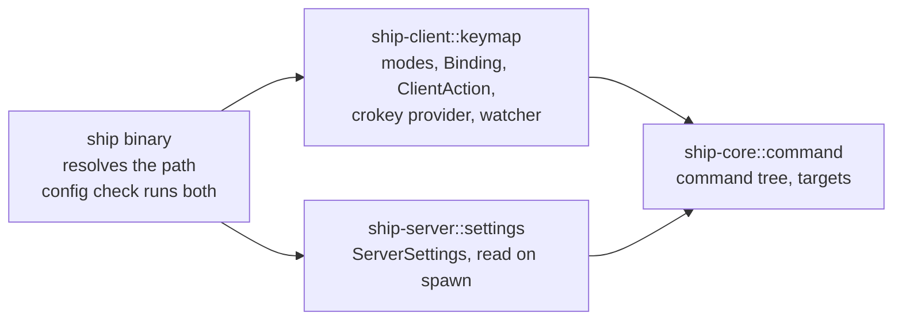
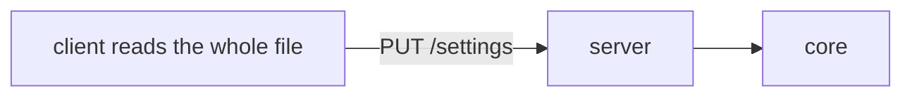
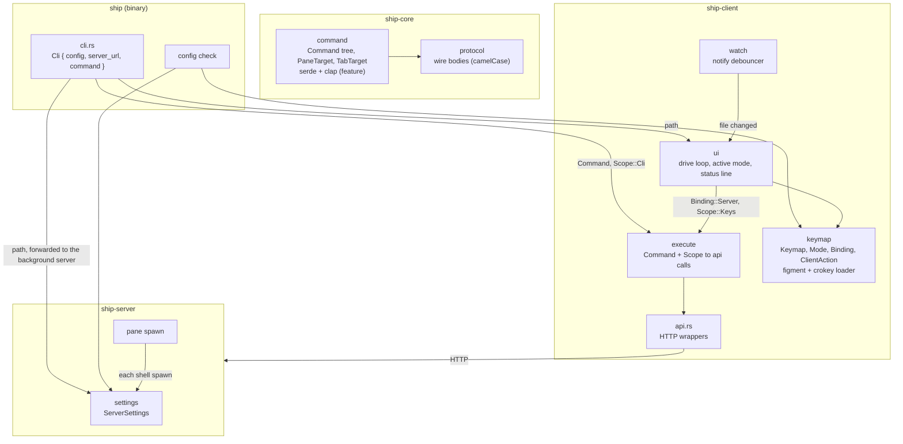

# Keys and config architecture

Status: Locked on 2026-10-09. Re-approved in chat the same day with product amendment A-3 (decision 3 and the `command` and `execute` boxes): `TabTarget` gains `--pane`, and `Scope::Cli` no longer carries a pane. Cyan approved it in Plannotator with "LGTM". During that review, Cyan decided in chat to move the modes under `[client]` (product amendment A-1), and this paper was edited to match while the review was open. It implements the locked [product paper](product.md), including A-1. Shape B was picked in chat ("B makes the most sense to me"), and it and the decisions below are approved architecture. This paper does not authorize code changes.

## Summary

The file belongs to no single crate. The `ship` binary works out which file to use and hands its path to the client and the server, and each one reads only its own part:

- `ship-client` owns the modes, the key bindings and the file watcher.
- `ship-server` owns `[server]` and re-reads it whenever it starts a shell.
- `ship-core` gains only the command tree: one named struct per `server.` action. Clap derives sit behind a `clap` feature, so the same structs are the CLI, the config's `server.` bindings and the source of the HTTP bodies.

One `execute` function in `ship-client` runs a command for both the CLI and the keys. It fills in a missing target from the pane the CLI runs in, or from the client's selection. Most of the hand-written argument structs and dispatch in `crates/ship/src/cli.rs` and `commands.rs` go away.

Needs Cyan's attention:

- **Decision 6, where a key-made tab goes:** to place a new tab after the selected tab in one request (FR-021), the create command takes the same destination as move. That gives `ship tab create` `--before` and `--after` beside `PARENT`, which the product paper didn't list.
- **Decision 4, which commands keys can bind:** `get` and `list` are CLI-only, so the config rejects them. `rename` and `move` can be bound, which goes past the product's Actions table.
- **Decision 8, what "location" means in errors:** an error names the file and the key path (`client.modes.normal.keys."alt-n"`), not a line number. Syntax errors still carry line and column.
- **Risk R-3, where key-made panes start:** in the server's home directory, the same as the starter pane. The product doesn't say. Herdr starts them in the focused pane's directory.

## Context and constraints

- `ship` is one binary that links `ship-client` and `ship-server` (`crates/ship/Cargo.toml`). Keeping a dependency out of the server buys nothing.
- `ship-core` already uses optional features to keep framework derives out of the plain types (`axum`, `kameo` in `crates/ship-core/Cargo.toml`). crokey 1.5 depends on crossterm 0.29, the version the workspace already pins, so the probe in the product grilling showed no second crossterm.
- Today the TUI sends no server commands. Keys only move the selection (`crates/ship-client/src/ui/keys.rs`, `navigate` in `ui/mod.rs`) and send input frames. The `drive` loop already awaits side requests in `Pending` slots (the view PUT, the input POST).
- The CLI's arguments are hand-mirrored from the protocol. `cli.rs` (165 lines) has `CreateTabArgs`, `CreatePaneArgs`, `IdArgs<T>`, `RenameArgs<T>`, `MoveTabArgs` and `Destination`, and `commands.rs` matches each one to an `api.rs` wrapper.
- The server already sets `SHIP_PANE_ID` in every pane (`crates/ship-server/src/pane.rs:122`), so the CLI knows which pane it runs in. `Pane` has no parent field, so the tab holding a pane is found by searching the tree.
- `IdOf<T>` implements `FromStr` (`crates/ship-core/src/id.rs:50`), so clap parses IDs with no custom value parser.
- The server picks its shell with `CommandBuilder::new_default_prog` when a pane has no command (`pane.rs:234`). `state::Starter` (`state.rs:268`) already makes a tab with one shell pane for `ship server --starter`.
- The background server is spawned by `crates/ship/src/local.rs:33`. It gets no config path today.
- The client/server boundary rule holds: client presentation (selection, mode, sidebar) stays client-local, and nothing about modes crosses the wire.
- The implementation Rust budget is about 20k lines, and we're at about 5k now. This change should come out close to net zero, because the deleted CLI mirror offsets the keymap.

## Candidate shapes

### A. Core owns the whole schema (rejected)

`ship-core::config` holds one `Config { server, client }` with `Binding`, `ClientAction`, `ServerSettings`, figment and crokey, and every crate reads through it. There's one loader and `ship config check` is a single call. But `ClientAction` and the mode vocabulary move into core even though nothing sends them anywhere, which blurs the client-local line, and core picks up figment, toml and crokey for types that only the client uses.

### B. Each process owns its part, and the binary finds the file (selected)

`cli.rs` resolves the path (`--config`, then `SHIP_CONFIG`, then the platform default from etcetera) and passes a `PathBuf` to the client and the server. It also forwards the path to the background server it spawns. The client extracts `client`, and the server extracts `server`, so a mistake in one never reaches the other (FR-003). The root holds only those two tables, so a top-level typo like `[srever]` is caught by the client, which checks the root with `server` ignored, and by `ship config check`, which runs both checks.

### C. The client pushes `[server]` to the server (rejected)

The client reads the whole file and sends the server its settings with `PUT /settings`. The server never touches the file. This contradicts the product paper ("that machine's server reads its own copy", FR-008's re-read on every spawn), and it adds a wire type and a route.

## Decision

Shape B. Keeping client-only vocabulary out of core mattered most. It keeps the boundary rule visible in the crate graph at the cost of one top-level ignore, while A puts `ClientAction` in core and C breaks the product paper.

## Structure

What each box owns:

- **`cli.rs`:** the clap root, with a global `--config` and `env = "SHIP_CONFIG"`, plus the default path. `ship tab …` and `ship pane …` are the core `Command` tree with clap flattened in. `server` and `config check` stay binary-only commands.
- **`command` (ship-core):** one named struct per `server.` action, grouped as `Command { Tab(TabCommand), Pane(PaneCommand) }`, externally tagged in snake_case. Each struct holds its own target as a `PaneTarget`, a `serde(transparent)` wrapper around `Option<IdOf<Pane>>` that clap flattens as `--pane` (with `env = "SHIP_PANE_ID"`), or a `TabTarget`, which clap flattens as `--tab` plus the same env-backed `--pane` and the config writes as one `NodeId` (A-3). This is the only list of `server.` actions.
- **`protocol` (ship-core):** stays the wire contract. Commands turn into existing bodies (`CreateTab`, `PaneInput`, `MoveTab`). `CreateTab` gains `starter` and a destination (decisions 6 and 7).
- **`execute` (ship-client):** takes a `Command` and a `Scope` and calls `api.rs`. `Scope::Cli` carries nothing, because clap has already filled `--pane` from `SHIP_PANE_ID` (A-3). `Scope::Keys` carries the client's selection and the replica's tabs. It resolves the target, calls the API and returns the resulting resource. "Not available yet" commands return an `Unavailable` error here.
- **`api.rs`:** unchanged HTTP wrappers. The utoipa route annotations remain the single description of each route.
- **`keymap` (ship-client):** `Keymap` maps mode names to `Mode { kind, keys }`, and `keys` maps a `KeyCombination` to a `Binding { Server(Command), Client(ClientAction), None }`. It holds the embedded `defaults.toml` and the loader.
- **`watch` (ship-client):** a notify debouncer on the config's directory, sending "changed" into the drive loop.
- **`ui`:** the active mode (client-local), the key-to-binding lookup, one command queue, the mode name and the last config error on the status line.
- **`settings` (ship-server):** `ServerSettings { shell }`, read from the forwarded path on each shell spawn.

## Key decisions

1. **Ownership follows the process (shape B).** The client owns `[client]` (the modes) and the server owns `[server]`. The binary resolves the path once and forwards it to the background server child, so both read the same file. Rejected: shape A (client vocabulary in core) and shape C (contradicts the product).

2. **The command tree is the CLI.** There's one named struct per command in `ship-core::command`, with `#[cfg_attr(feature = "clap", derive(Args))]` next to the serde derives, and the same struct is the config binding, the CLI subcommand and the input to `execute`. Rejected:
   - A separate `CliAction` converted into a shared enum (Zellij), which is a second list that drifts.
   - `PaneCommand { target, action }` with the target outside the action, which fights the derives and doesn't fit `pane create`, since a new pane has no ID yet.
   - A `Request` trait on commands, which repeats what `#[utoipa::path]` already says.

3. **Targets live in each struct, and `execute` resolves them.** `PaneTarget` is `serde(transparent)` around `Option<IdOf<Pane>>`. `TabTarget` holds `--tab` and `--pane`, and the config writes it as one ID, `"tab:…"` or `"pane:…"` (A-3). On the CLI, clap fills `--pane` from `SHIP_PANE_ID`, so `SHIP_PANE_ID` is read only there. `execute` resolves a target in this order:
   - An explicit `--tab` or `--pane` wins, `--tab` first. `--pane` on a tab command means the tab holding it, found with `GET /api/v0/tabs` (or the replica under keys) and a tree search. They aren't a clap group, because clap counts an env-filled `--pane` as given and would reject `--tab` inside a pane.
   - Under `Scope::Cli`, nothing is left to default to, so it errors (FR-026).
   - Under `Scope::Keys`, a missing target becomes the selection, or the selected pane's tab. A pane command with only a tab selected reports that (FR-020).
   - The mouse passes an explicit ID.

   Rejected: the server resolving "current" from a header. The server would need to know which pane the CLI runs in, and keys would still resolve against client-local selection.

4. **The config accepts every non-query command.** `get` and `list` carry `#[serde(skip)]`, so a binding to them is an unknown action (FR-004) while clap still offers them. `rename` and `move` can be bound, which is more than the product's Actions table lists. Rejected: a separate allowlist enum for bindings, which would be a second list.

5. **`Binding` wraps both sides, and both carry a namespace.** `enum Binding { Server(Command), Client(ClientAction), None }` lives in `ship-client::keymap` and is externally tagged in snake_case. TOML dotted keys give `{ server.pane.close = {} }`, and the unit variant gives `"none"`. `ClientAction` is client-local and never serialized to the wire. Rejected: a flat path string such as `action = "pane.close"` with a separate argument table, which needs a hand-written parser and gives worse errors.

6. **A new tab takes the move destination.** The tab create command and the `CreateTab` body take `Destination` (`PARENT | --before ID | --after ID`, at most one) in place of the bare parent. Keys send `after = selected tab` (FR-021), and the CLI gains `--before` and `--after` for free. Rejected: create, then move, which takes two requests and briefly shows the tab at the end of its parent.

7. **The starter reuses the server's starter.** `CreateTab` gains an optional `starter` (`"shell"`), and the server reuses the `state::Starter` path that `ship server --starter` already uses, so one request makes the tab and its shell pane (FR-029). `execute` returns the tab, and under `Scope::Keys` the client selects its pane.

8. **figment loads the file, and a small crokey provider canonicalizes the chords.**
   - The defaults are an embedded `defaults.toml` read through `Toml::string(include_str!(..))`.
   - Before the merge, a custom provider rewrites every chord key under `client.modes.*.keys` to crokey's canonical form (parse, then `Display`), for both the defaults and the user file, and reports two spellings of one chord in a mode as one error naming both keys (FR-010).
   - `clear_defaults` drops that mode's default keys before the merge (FR-012).
   - Each binding is then deserialized on its own, so `ship config check` collects every bad binding in one pass instead of stopping at the first (FR-009).
   - Errors name the file and the key path. Line and column come only from TOML syntax errors, because figment's value tree doesn't keep spans.

   Rejected:
   - A custom merge without figment, which owns a mechanism figment rents us.
   - A `Deserialize` wrapper on chord keys, which can't help because figment merges on raw `String` keys before any type sees them.

9. **Keys go through crokey, and the mode machine is client-local.** The client converts each event with `KeyCombination::from(KeyEvent)`, which normalizes Shift, and looks it up in the active mode:
   - A bound key runs its binding.
   - An unbound key in `normal` becomes an input frame, as today.
   - An unbound key in a sticky mode is dropped.
   - A one-shot mode returns to `normal` after any key, unless the binding itself was `client.mode` (FR-014, FR-015).

   Paste stays outside the keymap.

10. **The TUI runs server commands one at a time.** Bindings to `server.` actions go into a queue in the drive loop, which awaits them in order in one `Pending` slot. A result that creates something sets the pending selection, so the next view PUT selects it, and a failure goes to the status line. Rejected: running them concurrently, where `alt-n alt-n` could create tabs out of order.

11. **The client watches the directory, not the file.** A notify debouncer watches the config file's directory without recursing and filters events by file name, so rename-saves work. When the path is a symlink, it also watches the target's directory. A change, or `client.config.reload`, builds a fresh `Keymap`. On failure, the client keeps the running one and shows the error (FR-006, FR-007). Rejected: watching the file itself, which loses the watch after an editor's rename-save.

12. **The server reads the shell when it spawns one and doesn't watch.** For a pane with no command, the server extracts `server` from the forwarded path and uses `shell`, or falls back to `new_default_prog` and logs the error when the file is bad (FR-008). There's no cache: spawns are rare, and one small file read is negligible next to forking a PTY. Rejected: a server-side watcher, which isn't needed when every spawn re-reads.

## Risks and unknowns

- **R-1, enhancement flags:** if kitty keyboard flags are ever turned on, Shift can appear on symbol keys such as `|` and stop them matching `alt-|`. That's out of scope here (product non-goal), but the enhancement-flags change has to revisit `KeyCombination::from`.
- **R-2, one server per path:** the server's config path is fixed when the server starts. A later `ship --config other.toml` changes that client's keys but not the running server's shell. That matches "each process reads its own part", but it could surprise someone.
- **R-3, key-made pane directory:** panes from `server.pane.create` start in the server's home directory, because the keymap has no current directory to send. Starting in the selected pane's directory needs the server to report a pane's cwd, which is a separate change.
- **R-4, figment error quality:** semantic errors give a key path, not a line. If that reads badly in practice, a line lookup on the raw TOML by key path could be added later without changing the shape.
- **R-5, cost of the queue:** one command at a time adds a round trip per queued key. That's sub-millisecond on loopback, but a remote server would feel it. Revisit with network transport.
- **R-6, macOS Option:** Alt chords need "Option as Meta" in the terminal on macOS. Herdr's docs suggest `ctrl+alt` for the same reason. This changes the docs, not the shape.
