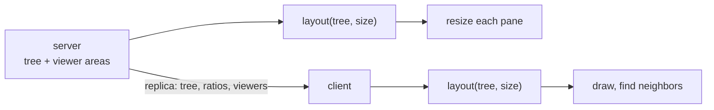
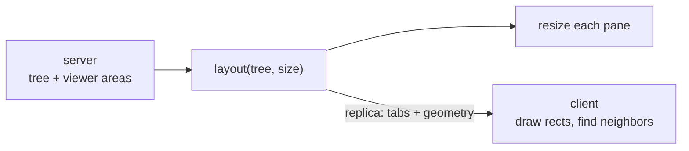
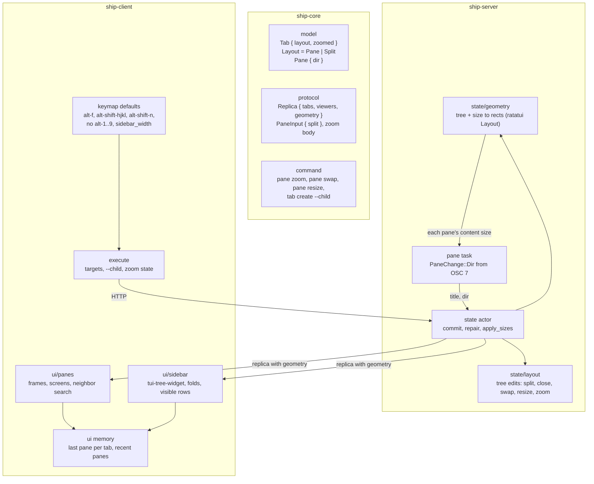

# Layout and sidebar architecture

Status: Locked on 2026-10-09, approved by Cyan in plannotator review ("LGTM") and locked once product amendment A-1 was re-approved in chat. Written on 2026-10-09 from the locked [product paper](product.md). Shape B was picked in chat: the server has to compute every pane's rectangle to size its terminal either way, so publishing them costs a few bytes while recomputing them in the client adds a second owner. Also in chat, Cyan moved the panes into the tree's leaves instead of a pane map beside it ("why not just stuff them in there?"), which needed product amendment A-1.

Amendment A-2: Locked on 2026-10-10, approved by Cyan in chat ("yep! that's approved to me!"). Cyan confirmed floating-point split fractions and squeeze-to-fit terminal shrink in chat, and on 2026-10-10 the 1x1 user-edit minimum and pane placement on `CreatePane` rather than in `PaneInput`. The original locked description is preserved below; the superseding amendment is recorded under Key decisions. The program paper was revised to match and locked the same day.

Amendment A-3: Locked on 2026-10-10, approved by Cyan in chat ("yep! that's approved to me!"). Product amendment A-2 replaces directional server swaps with ID-only swaps and client-side neighbor resolution. This reopens the architecture alongside amendment A-2 below. The original locked swap wording is preserved but superseded by A-3. Revised on 2026-10-10 after Cyan's answers in chat: the CLI directional adapter is dropped and the zoomed swap sequence is settled. A-2 also records the 1x1 user-edit minimum for R-2.

## Summary

The server owns the layout and its geometry. Each tab's panes move into a split tree, which holds both the panes and where they go, and the tab gains an optional zoomed pane. On every commit, the server turns each viewed tab's tree into rectangles at the tab's size, resizes each pane's terminal to its own rectangle, and publishes the rectangles in the replica beside the tabs. The client draws what it is given: a sidebar tree, bordered frames and the screens inside them. Fold state, the sidebar and per-client pane memory stay in the client.

Needs Cyan's attention:

- **Decision 3, what "reading order" means:** the split tree's own order, first child before second, like tmux. For `[A | [B / C]]` that's A, B, C. For `[[A / B] | C]` it's also A, B, C, although scanning rows on screen would give A, C, B.
- **Decision 6, while zoomed:** hidden panes keep the sizes they had, as in tmux, so their programs don't redraw twice on zoom and unzoom.
- **Decision 9, `alt-shift-n`:** the tab create command gains `--child`, meaning "under the tab I'm in". From keys that's the selected tab. From the CLI it's the tab holding `SHIP_PANE_ID`, so `ship tab create --child` works inside a pane.
- **Decision 7, the zoom request:** the wire takes an optional desired state. `ship pane zoom` and `alt-f` send none, which toggles. The client's unzoom before moving focus sends "off", so two clients racing can't zoom a tab back in.

## Context and constraints

- The server already streams the screen of every pane in a client's viewed tab (`crates/ship-server/src/attach.rs`, `Progress::view`), so showing splits needs no new stream.
- Tab size is the smallest viewer's area in each dimension (`state.rs`, `tab_sizes`), and `apply_sizes` sends that whole size to every pane in the tab. That is the one place where the area has to be divided.
- Selection is client-chosen but recorded on the server in `ViewingRecord`, and `commit` repairs every record after every edit (`state.rs:123`). The new close and zoom rules belong in that repair.
- `Tab.panes` is an `IndexMap`, and its order drives derived tab labels (`draw.rs`), `client.pane.next` and today's repair rule. It existed because there was no layout; with one, it would be a second copy of which panes exist and in what order.
- `docs/agents/code.md` asks for one source of truth: store what can't be derived, compute the rest, and give duplicated or cached state a reason. It also asks for named types over anonymous structure.
- The terminal wrapper emits `SessionEvent::CwdChanged` from OSC 7 (`vendor/ratatui-ghostty/src/session.rs:761`). Titles already travel from the pane task to the model through `PaneChange::Title` (`pane.rs:412`, `state.rs:611`).
- `pane::Create` already takes a `TabTarget` (`--tab` or `--pane`, `SHIP_PANE_ID` filling `--pane`) and a `direction` it ignores (`crates/ship-core/src/command.rs:235`). `execute` currently turns a `--pane` into the tab holding it.
- ratatui 0.30 is already a dependency of both the client and the server. Its `Layout` divides a `Rect` by constraints and can overlap neighbors by one cell, and `Block::merge_borders` draws shared edges. `tui-tree-widget` 0.24.1 renders a foldable tree on ratatui.
- Clients report the area they draw a tab in, after their own chrome (keys and config decision 14). The sidebar is client chrome; borders between panes are not, because they change every program's terminal size and every client must agree on them.
- The protocol is at version 7. The implementation Rust budget is about 20k lines, with about 6.5k used.

## Candidate shapes

### A. Shared layout function (rejected)

The replica carries the tree and its ratios. A pure function in ship-core turns a tree and a size into rectangles, and both sides call it: the server to size terminals, the client to draw and to find neighbors. The client also recomputes each tab's size from the replica's viewers. Nothing derived crosses the wire. But the server must compute every rectangle anyway, so this is shape B plus a second computation in the client. A client built from another version can round a border differently and draw over a pane's screen; the protocol version guards against it, but geometry has two owners.

### B. Server publishes geometry (selected)

The server computes each viewed tab's geometry once per commit and publishes it in the replica. It is derived and never stored. The client draws rectangles and searches neighbors among them. The terminal size a program sees and the frame drawn around it come from one computation, `ship tab get` and future plugins see the same geometry, and FR-019's "largest pane" uses rectangles the server already has. The cost is a few bytes per viewed tab, republished when a viewer resizes, which `SetView` already commits.

## Decision

Shape B. One owner for geometry mattered most, because a terminal one column off from its frame is the hardest multiplexer bug to notice, and A allows it for a saving of a few bytes.

## Structure

What each box owns:

- **`model` (ship-core):** `Tab` loses `panes` and gains `layout`, absent when the tab has no panes, and `zoomed`, an optional pane ID. `Layout` is either a `Pane` or a `Split`, a named struct holding an axis, a ratio and two child layouts. The tree's leaves are the panes themselves, so it is the only record of which panes a tab has and in what order. `Pane` gains `dir`, the directory the shell last reported, absent until it reports one.
- **`protocol` (ship-core):** `Replica` gains `geometry`, keyed by viewed tab: a named `TabGeometry` with the tab's size and, per visible pane, a `PaneGeometry` holding a frame rectangle and a content rectangle. `PaneInput` gains an optional split anchor, a pane and a direction. The zoom request carries an optional desired state. `PROTOCOL_VERSION` goes to 8.
- **`command` (ship-core):** `pane zoom`, `pane swap --direction` and a working `pane resize`. `tab create` gains `--child`.
- **`state/layout` (ship-server):** the tree edits, each a local rewrite of the tree inside the commit's edit closure: split a leaf, collapse a closed leaf's parent into its sibling, exchange two leaves, move a split's ratio. Each structural edit clears `zoomed` first. Lookups by ID walk the tree, and the tab's panes in order are a walk of its leaves, first child before second.
- **`state/geometry` (ship-server):** turns a tree and a size into rectangles with ratatui's `Layout`, overlapping neighbors by one cell so they share a border. A single pane, or a zoomed tab, gets the whole area with no border.
- **`state` actor (ship-server):** `commit` computes geometry for viewed tabs, puts it in the replica and sends each pane its own content size instead of the tab's size. `repair` gains the close and zoom rules. Pane creation resolves the anchor, the direction and the starting directory.
- **`pane` task (ship-server):** forwards `CwdChanged` as `PaneChange::Dir`, the same way it forwards titles.
- **`execute` (ship-client):** passes `--pane` through as the split anchor instead of resolving it to its tab, resolves `--child`, and sends zoom's desired state.
- **`ui/sidebar` (ship-client):** the "tabs" title and the tree, rendered with `tui-tree-widget`. It owns fold state and the visible-row list that `client.tab.next` and `prev` walk.
- **`ui/panes` (ship-client):** draws each frame with its label and merged borders, paints each screen into its content rectangle and finds the neighbor in a direction among the published rectangles.
- **`ui` memory (ship-client):** the pane this client last selected in each tab, and the order it selected panes in. Never sent anywhere.
- **`keymap` defaults (ship-client):** the new and removed bindings, and `sidebar_width` under `[client]`.

## Key decisions

1. **The server publishes geometry (shape B).** It is computed in `commit` for viewed tabs only and published in the replica beside `tabs`, never stored in `Tab`. It is derived data on the wire, which `docs/agents/code.md` asks to justify: the server computes it anyway to size terminals, so publishing it keeps one computation instead of two. Rejected:
   - Shape A, a second computation in the client.
   - Geometry inside `Tab`, which would copy tabs through `Arc::make_mut` on every viewer resize and put viewer-dependent data into the shared model.

2. **The layout is a binary split tree, and its leaves are the panes.** A node is a `Pane` or a `Split` with an axis, a ratio and two children. The ratio is a fraction, not a cell count, so splits keep their proportions when the tab resizes. Every edit rewrites one spot: splitting replaces a leaf with a split, closing replaces the parent with the sibling, swapping exchanges two leaves, and resizing moves the ratio of the nearest ancestor split whose edge lies in that direction. Rejected:
   - An n-ary split with weights, as tmux does. Merging same-axis splits and redistributing weights makes create and close harder, and the extra flexibility is not needed.
   - A pane map beside a tree of pane IDs (the first draft of this decision). Membership and order would live in two structures that every edit must keep in agreement.
   - Floating panes in the tree. They will be a separate list in the tab when their change comes (product A-1).

3. **Pane order is the tree's order.** A tab's panes, in order, are its leaves walked first child before second, so derived labels and `client.pane.next` follow FR-018 by reading the tree. The readers of `Tab.panes` today (derived labels, `client.pane.next`, `apply_sizes`, the attach stream's watched panes, the tree lookups in `ship_core::tree`) switch to that walk. Rejected:
   - Keeping the `IndexMap` and reordering it after each edit (the first draft). It avoided touching those readers at the cost of a second source of truth.
   - Geometric row scanning, which reorders panes whenever a ratio moves an edge past another.

4. **Each pane gets its own content size.** `apply_sizes` sends each pane the content rectangle's size from the geometry instead of the tab's size. Panes of tabs nobody views keep their sizes, as today.

5. **Borders are layout, not chrome.** With two or more panes, neighbors overlap by one cell and share it as a border, using ratatui's overlap and `Block::merge_borders`, and each content rectangle is its frame minus the border. The server must know this rule because it decides terminal sizes. The sidebar and bottom bar remain client chrome, outside the reported area. Rejected: borders as client chrome, which would make the server's sizes wrong for every client that draws them.

6. **Zoom is a field on the tab, and edits clear it.** `zoomed` names the pane that gets the whole area, without a border. Hidden panes keep their last sizes and their programs keep running. Creating, closing, swapping or resizing a pane in the tab clears `zoomed` in the same edit. `repair` moves any record whose selected pane is hidden in a zoomed tab onto the zoomed pane. That covers both the clients already there and a client that selects a hidden pane, because `SetView` commits through the same repair. Rejected: resizing hidden panes to zero, which makes their programs redraw for nothing.

7. **Zoom takes a desired state.** The request body has an optional `zoomed`: absent toggles, `false` unzooms and `true` zooms. `ship pane zoom` and `server.pane.zoom` send nothing. When `client.pane.focus` or `client.pane.next` leaves a zoomed pane, the client sends `false` and then moves, and its queue waits for the revision before moving (keys and config decision 13). Rejected: a toggle only, where two clients unzooming at once would zoom the tab back in.

8. **Pane creation splits an anchor, and the server places it.** `PaneInput` carries an optional anchor pane and direction:
   - Keys send the selected pane. The CLI sends `--pane`, which `SHIP_PANE_ID` fills inside a pane. `execute` stops turning `--pane` into its tab.
   - With only `--tab`, the server splits the tab's largest pane by content area, breaking ties by pane order, using the published geometry, or an 80x24 tab when nobody views the tab. A tab with no panes gets its first pane.
   - The direction defaults to right.
   - With no `cwd`, the server starts the pane in the anchor's `dir`, else the anchor's starting directory, else home. The CLI keeps sending the caller's directory, so only keys rely on this.

9. **`--child` places a new tab under the current one.** `tab create --child` resolves like a tab target: the selected tab, or the selected pane's tab, from keys, and the tab holding `SHIP_PANE_ID` from the CLI. It becomes the existing `Destination::Parent`, so the wire doesn't change. `alt-shift-n` binds `server.tab.create = { starter = "shell", child = true }`. With nothing selected, it falls back to the top level. Rejected: a "selected" keyword inside `Destination`, which puts a client-local idea into a type the server parses.

10. **The current directory is published like the title.** The pane task forwards `CwdChanged` as `PaneChange::Dir`, which commits into `Pane.dir`. A `cd` costs one commit, as a title change does. The CLI and plugins can read it with `ship pane get`, and the sidebar can show it later. Rejected: asking the pane task for its directory at creation time, which needs a new request channel to every pane task for one use.

11. **Repair on close follows the tree.** When a selected pane is closed, `repair` uses the old tree: the sibling subtree takes the space, and the selection moves to the pane in that subtree nearest the closed one, found by descending toward the closed side at splits on the same axis and taking the first child otherwise. This replaces the next-or-previous rule; the ancestor rules stay.

12. **The client draws, remembers and searches; it never computes layout.**
    - The sidebar uses `tui-tree-widget`. If it fights Ship's needs, it can be vendored as `ratatui-ghostty` was.
    - Directional focus searches the published rectangles for panes adjacent in that direction, and breaks ties by this client's recent panes, then by distance between centers. Swap reuses the same search.
    - Selecting a tab lands on this client's last pane there, else the first in pane order, else the zoomed pane when the tab is zoomed.
    - The reported area is the terminal minus the bottom bar and, when shown, the sidebar's `sidebar_width`.

    Rejected: client-side layout math, which is shape A.

### Amendment A-2: split fractions and terminal shrink (locked)

Cyan confirmed these choices in chat:

- **Split fractions:** decision 2's fraction is represented with floating point. It is the first child's share of the total split area, not first divided by second. `0.5` means equal halves; `0.7` means 70% for the first child and 30% for the second. First is left for a horizontal split and top for a vertical split. The fraction must be finite and strictly between zero and one. The program paper's earlier ten-thousandths integer proposal is superseded. Geometry still rounds to whole terminal cells.
- **Terminal shrink:** existing panes squeeze into the available tab area, even below any minimum used for user edits. The server preserves the split tree and stored fractions; it does not remove panes or retain a larger layout outside the visible area. Enlarging the terminal restores the proportions, subject to rounding. At extreme sizes a pane may have no visible content. Refusing undersized new splits and clamping manual resizes are separate proposals, not settled by this choice (the next bullet settles them).
- **User-edit minimum, settled on 2026-10-10:** splits and manual resizes keep every pane at 1 column by 1 row of content or more. That's a mechanical limit, not a comfortable one; tmux uses the same. A split that would go below it is refused ("no space for new pane"). A resize is clamped to it and commits nothing when the edge can't move. Terminal shrink still ignores the limit.
- **Pane placement, settled on 2026-10-10:** this supersedes decision 8's anchor in `PaneInput`. `PaneInput` also describes a new tab's starter pane, where an anchor means nothing, so the anchor goes on the create request instead: `CreatePane.at` names a tab or a pane, beside a `direction`, mirroring `CreateTab.at`. The server's placement rules in decision 8 are unchanged.

This supersedes R-2's open choice between fitting and clipping an existing layout. Safe handling of zero-content rendering and PTY sizing remains open. The slice 1 probe must verify them before implementation depends on them; it must not silently choose a new fallback.

### Amendment A-3: client resolves swap targets (locked)

Cyan confirmed this boundary in chat. This supersedes the swap portions of the command/protocol structure and decision 12 where relevant:

- The server swap request names the source pane in the route and the other pane in the body. It takes no direction or recency. The server validates that both panes belong to the same tab and exchanges their leaves in one commit; the existing structural-edit unzoom rule stands.
- `client.pane.swap` resolves a direction using published geometry and client-local recent selections, then sends the explicit pair. Missing neighbors are a no-op. Recency is never sent or stored on the server.
- The CLI names the other pane directly and has no directional form, so it never reads geometry. Directional swap exists only as the client action.
- The neighbor search lives in ship-core beside `TabGeometry`, the type it reads, not because the server needs directional resolution. Only the interactive client calls it. The server publishes geometry but does not choose swap neighbors.
- Once resolved, the request exchanges the named IDs even if geometry changes before execution, provided both remain in the same tab. Cross-tab swaps are rejected.

Directional resolution while zoomed needs unzoomed geometry. The client queues an explicit unzoom (decision 7's `zoomed: false`), waits for its revision, then resolves on the published unzoomed geometry. With no neighbor the tab stays unzoomed and no swap is sent. The server does not regain directional resolution.

## Risks and unknowns

- **R-1, ratatui rounding and overlap:** decision 5 relies on `Layout`'s one-cell overlap and `Block::merge_borders` in ratatui 0.30 producing frames whose shared edges line up at every size. The first slice should check odd widths and three-way splits before anything builds on it.
- **R-2, tiny tabs (original framing, superseded by A-2):** a small smallest-client area can leave a pane with zero content rows. Geometry needs a minimum content size, and the behavior below it (clip, or refuse the split) isn't decided. A-2 settles terminal shrink as squeeze-to-fit. Cyan settled the user-edit minimum in chat on 2026-10-10 as a mechanical 1x1 of content: a split that would go below it is refused, and a resize is clamped. Zero-content rendering and PTY handling, which only terminal shrink can reach, stay open for the slice 1 probe.
- **R-3, commit volume:** `dir` adds a commit per directory change in every pane. Titles already do this, so it should be fine, but an agent changing directory in a loop would republish the replica each time.
- **R-4, replica size:** geometry is per viewed tab, so it grows with the number of distinct tabs being viewed, not the number of tabs. If remote clients make the replica's size matter, geometry could move to the attach stream per client.
- **R-5, OSC 7 in practice:** `dir` depends on the shell reporting it. Cyan's oh-my-zsh setup should, since Ship sets `TERM=xterm-256color`, but it hasn't been checked in a live pane. Without it, key-made panes start in the anchor's starting directory.
- **R-6, unviewed tabs:** `ship pane create --tab` on a tab nobody views picks the largest pane at 80x24. If its panes were last sized for a larger client, the choice can differ from what a viewer would see.
